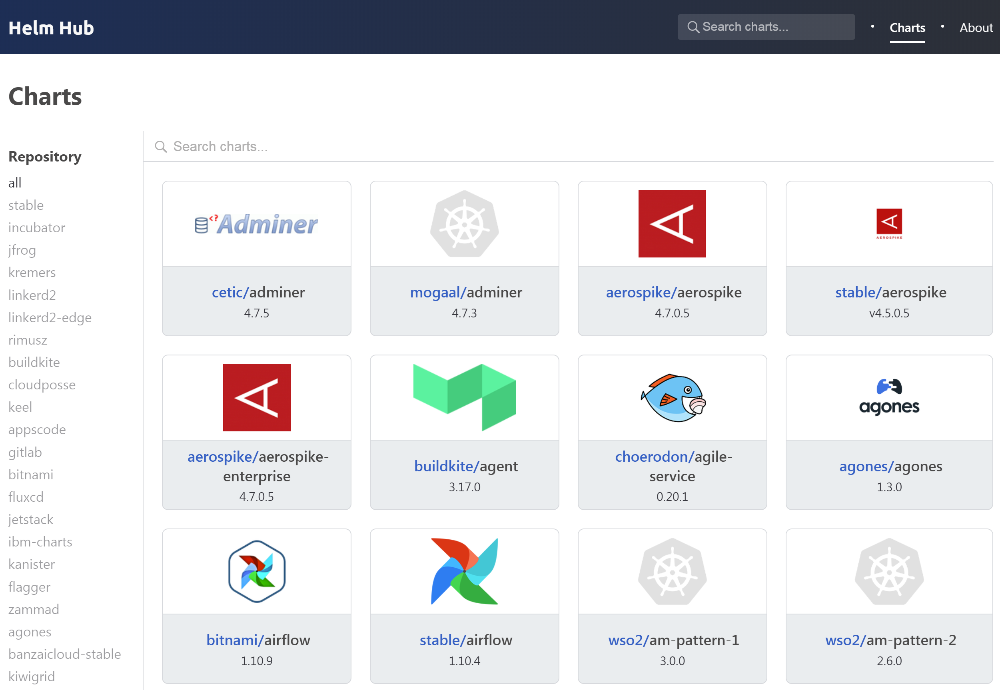
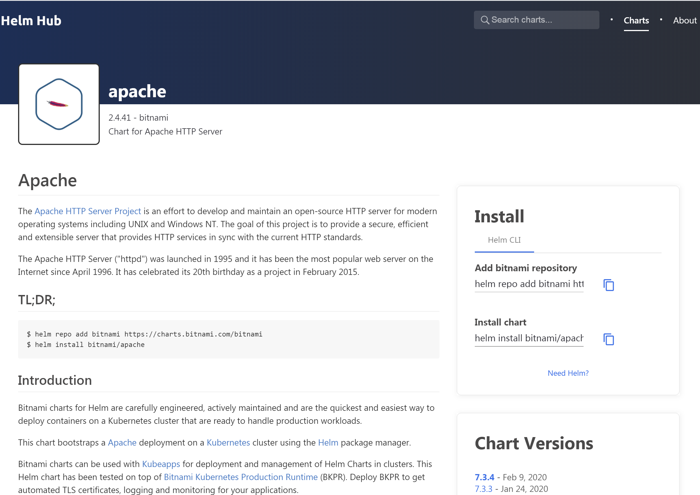

# Helm v3概念和常用命令详述

## Helm v3概念

- ### Chart

Helm的应用包，采用tgz格式。类似于Yum的RPM包，其包含了一组定义Kubernetes资源相关的YAML文件。也称为应用Chart。

- ### Repoistory

Helm的应用仓库，Repository本质上是一个Web服务器，该服务器保存了一系列的Chart应用包以供用户下载，并且提供了一个该Repository的Chart包的清单文件以供查询。Helm可以同时管理多个不同的Repository。

Helm社区官方提供了stable和incubator仓库，但Helm社区没有打算独占仓库，而是允许其他人和组织也可以搭建仓库。仓库可以是公共仓库，也可以是私有仓库。

- ### Hub

不同的个人和组织提供的公共仓库形成了分散和分布的Helm仓库，不利于查找，所以官方提供了Helm Hub，各公共仓库可以注册到Helm Hub中以方便集中查找，Helm Hub只是分布的仓库的集中展示中心。

仓库注册到Helm Hub时，会将Chart清单文件向Helm Hub同步一份，这样可以在Helm Hub集中展示仓库列表和各仓库中的Chart列表。

Helm Hub地址为[https://hub.helm.sh/charts](https://hub.helm.sh/charts)，下图的左边为注册到Helm Hub中的仓库列表，点击仓库链接，右边为该仓库的Chart列表。



Chart包也就是tgz文件实际上存储在各仓库中。Helm Hub并不实际存储Chart包。Helm只是在查询Chart时和Helm Hub有交互，其它操作都是和仓库直接交互的。

点击上图的某个Chart图标，打开Chart详细说明页面（下图），右边Install区域可以看到如何增加该Chart所在的仓库。



- ### Release

在Kubernetes集群上运行的Chart的一个实例。在同一个集群上，一个Chart可以安装很多次。每次安装都会创建一个新的Release。例如一个MySQL Chart，如果想在服务器上运行两个MySQL数据库，就可以把这个Chart安装两次。每次安装都会生成一个新的Release。

----------
## Helm v3常用命令
### 索引

- [helm version](#version)
- [helm help](#help)
- [helm completion](#completion)
- [helm env](#env)
- [helm repo](#repo)
- [helm search](#search)
- [helm pull](#pull)
- [helm install](#install)
- [helm list](#list)
- [helm uninstall](#uninstall)
- [helm test](#test)
- [helm upgrade](#upgrade)
- [helm status](#status)
- [helm history](#history)
- [helm rollback](#rollback)
- [helm get](#get)
- [helm create](#create)
- [helm show](#show)
- [helm template](#template)
- [helm dependency](#dependency)
- [helm lint](#lint)
- [helm package](#package)
- [helm plugin](#plugin)
- [helm verify](#verify)

<a id="version">&nbsp;</a>
- ### helm version

查看helm版本。

    helm version
    version.BuildInfo{Version:"v3.0.2", GitCommit:"19e47ee3283ae98139d98460de796c1be1e3975f", GitTreeState:"clean", GoVersion:"go1.13.5"}

查看helm短版本。

    helm version --short
    v3.0.2+g19e47ee

<a id="help"></a>
- ### helm help

查看命令行帮助，有以下几种方式：

  + helm
  + helm help
  + helm help [command]
  + helm -h(常用)
  + helm --help
  + helm [command] -h(常用)
  + helm [command] -help
  + helm [command] [sub command] -h(常用)
  + helm [command] [sub command] -help

查看命令行帮助。

    helm -h
    The Kubernetes package manager
    
    Common actions for Helm:
    
    - helm search:    search for charts
    - helm pull:      download a chart to your local directory to view
    - helm install:   upload the chart to Kubernetes
    - helm list:      list releases of charts
    
    Environment variables:
    
    +------------------+-----------------------------------------------------------------------------+
    | Name             | Description                                                                 |
    +------------------+-----------------------------------------------------------------------------+
    | $XDG_CACHE_HOME  | set an alternative location for storing cached files.                       |
    | $XDG_CONFIG_HOME | set an alternative location for storing Helm configuration.                 |
    | $XDG_DATA_HOME   | set an alternative location for storing Helm data.                          |
    | $HELM_DRIVER     | set the backend storage driver. Values are: configmap, secret, memory       |
    | $HELM_NO_PLUGINS | disable plugins. Set HELM_NO_PLUGINS=1 to disable plugins.                  |
    | $KUBECONFIG      | set an alternative Kubernetes configuration file (default "~/.kube/config") |
    +------------------+-----------------------------------------------------------------------------+
    
    Helm stores configuration based on the XDG base directory specification, so
    
    - cached files are stored in $XDG_CACHE_HOME/helm
    - configuration is stored in $XDG_CONFIG_HOME/helm
    - data is stored in $XDG_DATA_HOME/helm
    
    By default, the default directories depend on the Operating System. The defaults are listed below:
    
    +------------------+---------------------------+--------------------------------+-------------------------+
    | Operating System | Cache Path                | Configuration Path             | Data Path               |
    +------------------+---------------------------+--------------------------------+-------------------------+
    | Linux            | $HOME/.cache/helm         | $HOME/.config/helm             | $HOME/.local/share/helm |
    | macOS            | $HOME/Library/Caches/helm | $HOME/Library/Preferences/helm | $HOME/Library/helm      |
    | Windows          | %TEMP%\helm               | %APPDATA%\helm                 | %APPDATA%\helm          |
    +------------------+---------------------------+--------------------------------+-------------------------+
    
    Usage:
      helm [command]
    
    Available Commands:
      completion  Generate autocompletions script for the specified shell (bash or zsh)
      create      create a new chart with the given name
      dependency  manage a chart's dependencies
      env         Helm client environment information
      get         download extended information of a named release
      help        Help about any command
      history     fetch release history
      install     install a chart
      lint        examines a chart for possible issues
      list        list releases
      package     package a chart directory into a chart archive
      plugin      install, list, or uninstall Helm plugins
      pull        download a chart from a repository and (optionally) unpack it in local directory
      repo        add, list, remove, update, and index chart repositories
      rollback    roll back a release to a previous revision
      search      search for a keyword in charts
      show        show information of a chart
      status      displays the status of the named release
      template    locally render templates
      test        run tests for a release
      uninstall   uninstall a release
      upgrade     upgrade a release
      verify      verify that a chart at the given path has been signed and is valid
      version     print the client version information
    
    Flags:
          --add-dir-header                   If true, adds the file directory to the header
          --alsologtostderr                  log to standard error as well as files
          --debug                            enable verbose output
      -h, --help                             help for helm
          --kube-context string              name of the kubeconfig context to use
          --kubeconfig string                path to the kubeconfig file
          --log-backtrace-at traceLocation   when logging hits line file:N, emit a stack trace (default :0)
          --log-dir string                   If non-empty, write log files in this directory
          --log-file string                  If non-empty, use this log file
          --log-file-max-size uint           Defines the maximum size a log file can grow to. Unit is megabytes. If the value is 0, the maximum file size is unlimited. (default 1800)
          --logtostderr                      log to standard error instead of files (default true)
      -n, --namespace string                 namespace scope for this request
          --registry-config string           path to the registry config file (default "/root/.config/helm/registry.json")
          --repository-cache string          path to the file containing cached repository indexes (default "/root/.cache/helm/repository")
          --repository-config string         path to the file containing repository names and URLs (default "/root/.config/helm/repositories.yaml")
          --skip-headers                     If true, avoid header prefixes in the log messages
          --skip-log-headers                 If true, avoid headers when opening log files
          --stderrthreshold severity         logs at or above this threshold go to stderr (default 2)
      -v, --v Level                          number for the log level verbosity
          --vmodule moduleSpec               comma-separated list of pattern=N settings for file-filtered logging
    
    Use "helm [command] --help" for more information about a command.

<a id="completion"></a>
- ### helm completion

Helm命令补全。

    yum install -y bash-completion
    source /usr/share/bash-completion/bash_completion
    source <(helm completion bash)

    # 顺便补全kubectl。
    source <(kubectl completion bash)

    helm <tab>
    completion  dependency  get         install     list        plugin      repo        search      status      test        upgrade     version
    create      env         history     lint        package     pull        rollback    show        template    uninstall   verify

<a id="env"></a>
- ### helm env

打印出Helm使用的所有环境变量。

    helm env
    HELM_KUBECONTEXT=""
    HELM_BIN="helm"
    HELM_DEBUG="false"
    HELM_PLUGINS="/root/.local/share/helm/plugins"
    HELM_REGISTRY_CONFIG="/root/.config/helm/registry.json"
    HELM_REPOSITORY_CACHE="/root/.cache/helm/repository"
    HELM_REPOSITORY_CONFIG="/root/.config/helm/repositories.yaml"
    HELM_NAMESPACE="default"

<a id="repo"></a>
- ### helm repo

Helm仓库的管理。

- #### helm repo add

增加仓库，以下命令为增加helm官方stable仓库，命令中stable为仓库名称，链接为仓库的Chart清单文件地址。当增加仓库时，Helm会将仓库的Chart清单文件下载到本地并存放到Kubernetes中，以后helm search、install和pull等操作都通过仓库名称到Kubernetes中查找该仓库相关的Chart包。可以注意到官方的stable仓库的地址和Helm Hub地址是不同的，两者是独立存在的，stable仓库只是众多公共仓库之一，但是是Helm官方提供的。

	helm repo add stable https://kubernetes-charts.storage.googleapis.com

以下为官方stable仓库的清单文件，地址[https://kubernetes-charts.storage.googleapis.com](https://kubernetes-charts.storage.googleapis.com)。可以看出就是一个个Chart包的信息，按照字母顺序排列，而且只到D开头的Chart包，所有Chart清单应该分片为多个清单文件，应该多次请求才能全部下载下来。也可以直接访问[https://kubernetes-charts.storage.googleapis.com/ambassador-5.3.1.tgz](https://kubernetes-charts.storage.googleapis.com/ambassador-5.3.1.tgz)将tgz包下载下来。

    <ListBucketResult xmlns="http://doc.s3.amazonaws.com/2006-03-01">
      <Name>kubernetes-charts</Name>
      <Prefix/>
      <Marker/>
      <NextMarker>datadog-0.2.0.tgz</NextMarker>
      <IsTruncated>true</IsTruncated>
      <Contents>
        <Key>acs-engine-autoscaler-0.1.0.tgz</Key>
        <Generation>1501637633913843</Generation>
        <MetaGeneration>1</MetaGeneration>
        <LastModified>2017-08-02T01:33:53.600Z</LastModified>
        <ETag>"7ba1dd9555e78f23eac07a7223cdad18"</ETag>
        <Size>4069</Size>
      </Contents>
      <Contents>
        <Key>acs-engine-autoscaler-1.0.0.tgz</Key>
        <Generation>1505061247273212</Generation>
        <MetaGeneration>1</MetaGeneration>
        <LastModified>2017-09-10T16:34:07.187Z</LastModified>
        <ETag>"fcea91b52795fb8576be7a62ceebb731"</ETag>
        <Size>4229</Size>
      </Contents>
      <Contents>
        <Key>acs-engine-autoscaler-2.0.0.tgz</Key>
        <Generation>1507577650862706</Generation>
        <MetaGeneration>1</MetaGeneration>
        <LastModified>2017-10-09T19:34:10.842Z</LastModified>
        <ETag>"500fa8390acdd0cc98eb8d0548ec8268"</ETag>
        <Size>4238</Size>
      </Contents>
      <Contents>
        <Key>acs-engine-autoscaler-2.1.0.tgz</Key>
        <Generation>1510935533778152</Generation>
        <MetaGeneration>1</MetaGeneration>
        <LastModified>2017-11-17T16:18:53.738Z</LastModified>
        <ETag>"d9f92504ce7cee39d5790e56c14bc8f0"</ETag>
        <Size>4228</Size>
      </Contents>
      .....
      <Contents>
        <Key>datadog-0.2.0.tgz</Key>
        <Generation>1486783107723000</Generation>
        <MetaGeneration>1</MetaGeneration>
        <LastModified>2017-02-11T03:18:27.708Z</LastModified>
        <ETag>"066d6eb53b0c70318322b87d980753ae"</ETag>
        <Size>2968</Size>
      </Contents>
    </ListBucketResult>

以下为几个常用的仓库的添加命令。

    helm repo add incubator https://kubernetes-charts-incubator.storage.googleapis.com
    helm repo add bitnami https://charts.bitnami.com/bitnami
    helm repo add aliyuncs https://apphub.aliyuncs.com
    helm repo add kong https://charts.konghq.com

- #### helm repo list

查看加到本地的仓库列表。

    helm repo list
    NAME            URL
    stable          https://kubernetes-charts.storage.googleapis.com
    aliyuncs        https://apphub.aliyuncs.com
    bitnami         https://charts.bitnami.com/bitnami
    incubator       https://kubernetes-charts-incubator.storage.googleapis.com
    kong            https://charts.konghq.com

Helm v3取消了v2的local repo，Helm v3本地增加的仓库列表存放在/root/.config/helm/repositories.yaml

    cat /root/.config/helm/repositories.yaml
    apiVersion: ""
    generated: "0001-01-01T00:00:00Z"
    repositories:
    - caFile: ""
      certFile: ""
      keyFile: ""
      name: stable
      password: ""
      url: https://kubernetes-charts.storage.googleapis.com
      username: ""
    - caFile: ""
      certFile: ""
      keyFile: ""
      name: aliyuncs
      password: ""
      url: https://apphub.aliyuncs.com
      username: ""
    - caFile: ""
      certFile: ""
      keyFile: ""
      name: bitnami
      password: ""
      url: https://charts.bitnami.com/bitnami
      username: ""
    - caFile: ""
      certFile: ""
      keyFile: ""
      name: incubator
      password: ""
      url: https://kubernetes-charts-incubator.storage.googleapis.com
      username: ""
    - caFile: ""
      certFile: ""
      keyFile: ""
      name: kong
      password: ""
      url: https://charts.konghq.com
      username: ""

仓库的Chart清单应该是存储在Kubernetes的etcd中，但在/root/.cache/helm/repository存储了备份。下载的Chart包也缓存在该目录下。

    ls /root/.cache/helm/repository
    aliyuncs-index.yaml   bitnami-index.yaml    kong-index.yaml  nginx-5.1.4.tgz    tomcat-6.1.3.tgz
    ambassador-6.1.1.tgz  incubator-index.yaml  mysql-1.6.2.tgz  stable-index.yaml

- #### helm repo remove

移除本地仓库。

    helm repo remove kong
    "kong" has been removed from your repositories

- #### helm repo update

更新本地仓库，将仓库的实时清单文件更新到Kubernetes中。

    helm repo update
    Hang tight while we grab the latest from your chart repositories...
    ...Successfully got an update from the "kong" chart repository
    ...Successfully got an update from the "incubator" chart repository
    ...Successfully got an update from the "aliyuncs" chart repository
    ...Successfully got an update from the "bitnami" chart repository
    ...Successfully got an update from the "stable" chart repository
    Update Complete. ⎈ Happy Helming!⎈

- #### helm repo index

根据本地目录生成Chart清单文件。和helm package命令配合用来搭建私有仓库。

    ls
    kong-1.1.1.tgz  tomcat-6.1.6.tgz
    
    helm repo index .
    
    ls
    index.yaml  kong-1.1.1.tgz  tomcat-6.1.6.tgz
    
    cat index.yaml
    apiVersion: v1
    entries:
      kong:
      - apiVersion: v1
        appVersion: "1.4"
        created: "2020-02-12T10:04:06.478170989+08:00"
        dependencies:
        - condition: postgresql.enabled
          name: postgresql
          repository: https://kubernetes-charts.storage.googleapis.com/
          version: ~8.1.0
        description: The Cloud-Native Ingress and API-management
        digest: 2439910d3de8757b2c7ed8c57952537df2c15e755df9ec35675bb26a81b7b1c2
        home: https://konghq.com/
        icon: https://s3.amazonaws.com/downloads.kong/universe/assets/icon-kong-inc-large.png
        maintainers:
        - email: shashi@konghq.com
          name: shashiranjan84
        - email: harry@konghq.com
          name: hbagdi
        name: kong
        urls:
        - kong-1.1.1.tgz
        version: 1.1.1
      tomcat:
      - apiVersion: v1
        appVersion: 9.0.30
        created: "2020-02-12T10:04:06.489744806+08:00"
        description: Chart for Apache Tomcat
        digest: 2b2e7d7ba14b1e8a7ed9ef42fa7d9591fe5e9514224728188056ba5b2bba79f2
        home: http://tomcat.apache.org
        icon: https://bitnami.com/assets/stacks/tomcat/img/tomcat-stack-110x117.png
        keywords:
        - tomcat
        - java
        - http
        - web
        - application server
        - jsp
        maintainers:
        - email: containers@bitnami.com
          name: Bitnami
        name: tomcat
        sources:
        - https://github.com/bitnami/bitnami-docker-tomcat
        urls:
        - tomcat-6.1.6.tgz
        version: 6.1.6
    generated: "2020-02-12T10:04:06.40968204+08:00"

生成index.yaml后，将所有的tgz的Chart包和index.yaml放到web服务器提供下载，即可搭建一个私有仓库。

<a id="search"></a>
- ### helm search

查询Chart包，查询命令分为helm search hub和helm search repo。

- helm search hub，只从Helm Hub中查找Chart，这些Chart来自于注册到Helm Hub中的各个仓库。
- helm search repo，从所有加到本地的仓库中查找应用，这些仓库加到本地时Chart清单文件已被存放到Kubernetes中，所以查找应用时无需联网。

- #### helm search hub

从Helm Hub中查询Chart，而且只展示最新Chart版本。

    helm search hub kong
    URL                                     CHART VERSION   APP VERSION     DESCRIPTION
    https://hub.helm.sh/charts/stable/kong  0.36.6          1.4             DEPRECATED The Cloud-Native Ingress and API-man...
    https://hub.helm.sh/charts/kong/kong    1.1.1           1.4             The Cloud-Native Ingress and API-management

注意到Kong在Helm Hub中有两条记录，应该是原来Kong公司没有自己的仓库，Kong Chart是直接存放在官方的stable仓库，后来Kong搭建了自己的仓库，自行维护Chart了，原来的stable/kong标明被废弃了。至于能通过helm search hub命令查询到kong/kong，是因为Kong仓库注册到了Helm Hub，可以在上图的Helm Hub的左边仓库列表中找到Kong仓库。

- #### helm search repo

从本地的仓库列表中查询Chart，而且只展示Chart最新版本。注意Chart包本身有版本号，区别于Chart包中应用的版本号。

    helm search repo kong
    NAME            CHART VERSION   APP VERSION     DESCRIPTION
    aliyuncs/kong   0.27.0          1.3             The Cloud-Native Ingress and Service Mesh for A...
    kong/kong       1.1.1           1.4             The Cloud-Native Ingress and API-management
    stable/kong     0.32.0          1.4             The Cloud-Native Ingress and Service Mesh for A...

注意到aliyuncs/kong在helm search hub命令中没有查询到，是因为aliyuncs仓库并没有注册到Helm Hub中，在上图的Helm Hub的左边仓库列表中是找不到aliyuncs仓库的。

查询某个特定Chart版本。

    helm search repo kong --version '1.0.1'
    NAME            CHART VERSION   APP VERSION     DESCRIPTION
    kong/kong       1.0.1           1.4             The Cloud-Native Ingress and API-management

查询所有Chart版本。

    helm search repo kong --versions
    NAME            CHART VERSION   APP VERSION     DESCRIPTION
    aliyuncs/kong   0.27.0          1.3             The Cloud-Native Ingress and Service Mesh for A...
    aliyuncs/kong   0.26.0          1.3             The Cloud-Native Ingress and Service Mesh for A...
    aliyuncs/kong   0.24.0          1.3             The Cloud-Native Ingress and Service Mesh for A...
    aliyuncs/kong   0.23.0          1.3             The Cloud-Native Ingress and Service Mesh for A...
    aliyuncs/kong   0.22.1          1.3             The Cloud-Native Ingress and Service Mesh for A...
    kong/kong       1.1.1           1.4             The Cloud-Native Ingress and API-management
    kong/kong       1.1.0           1.4             The Cloud-Native Ingress and API-management
    kong/kong       1.0.3           1.4             The Cloud-Native Ingress and API-management
    kong/kong       1.0.2           1.4             The Cloud-Native Ingress and API-management
    kong/kong       1.0.1           1.4             The Cloud-Native Ingress and API-management
    kong/kong       1.0.0           1.4             The Cloud-Native Ingress and API-management
    kong/kong       0.36.5          1.4             The Cloud-Native Ingress and API-management
    stable/kong     0.32.0          1.4             The Cloud-Native Ingress and Service Mesh for A...
    stable/kong     0.31.2          1.4             The Cloud-Native Ingress and Service Mesh for A...
    stable/kong     0.31.1          1.4             The Cloud-Native Ingress and Service Mesh for A...
    stable/kong     0.31.0          1.4             The Cloud-Native Ingress and Service Mesh for A...
    stable/kong     0.30.1          1.3             The Cloud-Native Ingress and Service Mesh for A...
    stable/kong     0.30.0          1.3             The Cloud-Native Ingress and Service Mesh for A...
    stable/kong     0.29.0          1.3             The Cloud-Native Ingress and Service Mesh for A...
    stable/kong     0.28.0          1.3             The Cloud-Native Ingress and Service Mesh for A...
    stable/kong     0.27.2          1.3             The Cloud-Native Ingress and Service Mesh for A...
    stable/kong     0.27.1          1.3             The Cloud-Native Ingress and Service Mesh for A...
    stable/kong     0.27.0          1.3             The Cloud-Native Ingress and Service Mesh for A...
    stable/kong     0.26.1          1.3             The Cloud-Native Ingress and Service Mesh for A...
    stable/kong     0.26.0          1.3             The Cloud-Native Ingress and Service Mesh for A...
    stable/kong     0.25.0          1.3             The Cloud-Native Ingress and Service Mesh for A...
    ......
    stable/kong     0.18.0          1.3             The Cloud-Native Ingress and Service Mesh for A...
    stable/kong     0.17.0          1.3             The Cloud-Native Ingress and Service Mesh for A...
    stable/kong     0.16.1          1.2             The Cloud-Native Ingress and Service Mesh for A...
    stable/kong     0.16.0          1.2             The Cloud-Native Ingress and Service Mesh for A...
    stable/kong     0.15.2          1.2             The Cloud-Native Ingress and Service Mesh for A...
    stable/kong     0.15.1          1.2             The Cloud-Native Ingress and Service Mesh for A...
    stable/kong     0.15.0          1.2             The Cloud-Native Ingress and Service Mesh for A...
    stable/kong     0.14.3          1.2             The Cloud-Native Ingress and Service Mesh for A...
    stable/kong     0.14.2          1.2             The Cloud-Native Ingress and Service Mesh for A...
    stable/kong     0.14.1          1.2             The Cloud-Native Ingress and Service Mesh for A...
    stable/kong     0.14.0          1.2             The Cloud-Native Ingress and Service Mesh for A...
    stable/kong     0.13.0          1.2             The Cloud-Native Ingress and Service Mesh for A...
    stable/kong     0.12.2          1.2             The Cloud-Native Ingress and Service Mesh for A...
    stable/kong     0.12.1          1.1             The Cloud-Native Ingress and Service Mesh for A...
    stable/kong     0.12.0          1.1             The Cloud-Native Ingress and Service Mesh for A...
    stable/kong     0.11.2          1.1             The Cloud-Native Ingress and Service Mesh for A...
    stable/kong     0.11.1          1.1             The Cloud-Native Ingress and Service Mesh for A...
    stable/kong     0.11.0          1.1             The Cloud-Native Ingress and Service Mesh for A...
    stable/kong     0.10.3          1.1             The Cloud-Native Ingress and Service Mesh for A...
    stable/kong     0.10.2          1.1             The Cloud-Native Ingress and Service Mesh for A...
    stable/kong     0.10.1          1.1             The Cloud-Native Ingress and Service Mesh for A...
    stable/kong     0.10.0          1.1             The Cloud-Native Ingress and Service Mesh for A...
    stable/kong     0.9.9           1.1             The Cloud-Native Ingress and Service Mesh for A...
    stable/kong     0.9.8           1.0.2           The Cloud-Native Ingress and Service Mesh for A...
    stable/kong     0.9.7           1.0.2           The Cloud-Native Ingress and Service Mesh for A...
    stable/kong     0.9.6           1.0.2           The Cloud-Native Ingress and Service Mesh for A...
    stable/kong     0.9.5           1.0.2           The Cloud-Native Ingress and Service Mesh for A...
    ......
    stable/kong     0.3.0           0.14.0          Kong is open-source API Gateway and Microservic...
    stable/kong     0.2.7           0.13.1          Kong is open-source API Gateway and Microservic...
    stable/kong     0.2.6           0.13.1          Kong is open-source API Gateway and Microservic...
    stable/kong     0.2.5           0.13.0          Kong is open-source API Gateway and Microservic...
    stable/kong     0.2.4           0.13.0          Kong is open-source API Gateway and Microservic...
    stable/kong     0.2.3           0.12.3          Kong is open-source API Gateway and Microservic...
    stable/kong     0.2.2           0.12.3          Kong is open-source API Gateway and Microservic...
    stable/kong     0.2.1           0.12.2          Kong is open-source API Gateway and Microservic...
    stable/kong     0.2.0           0.12.2          Kong is open-source API Gateway and Microservic...
    stable/kong     0.1.2           0.12.1          Kong is open-source API Gateway and Microservic...
    stable/kong     0.1.1           0.12.1          Kong is open-source API Gateway and Microservic...
    stable/kong     0.1.0           0.12.1          Kong is open-source API Gateway and Microservic...

查询某个范围的Chart版本，以下要求Chart版本号大于等于1.0.0。

    helm search repo kong --version '>=1.0.0' --versions
    NAME            CHART VERSION   APP VERSION     DESCRIPTION
    kong/kong       1.1.1           1.4             The Cloud-Native Ingress and API-management
    kong/kong       1.1.0           1.4             The Cloud-Native Ingress and API-management
    kong/kong       1.0.3           1.4             The Cloud-Native Ingress and API-management
    kong/kong       1.0.2           1.4             The Cloud-Native Ingress and API-management
    kong/kong       1.0.1           1.4             The Cloud-Native Ingress and API-management

<a id="pull"></a>
- ### helm pull

将Chart包下载到本地，缺省下载的是最新的Chart版本，并且是tgz包。

    # 先查询Chart，选择一个合适的Chart。
    helm search repo tomcat
    NAME            CHART VERSION   APP VERSION     DESCRIPTION
    aliyuncs/tomcat 6.1.3           9.0.30          Chart for Apache Tomcat
    bitnami/tomcat  6.1.5           9.0.30          Chart for Apache Tomcat
    stable/tomcat   0.4.1           7.0             Deploy a basic tomcat application server with s...
    
    # 下拉Chart包。
    helm pull bitnami/tomcat
    
    ls
    tomcat-6.1.5.tgz

    # 可以解压Chart包。
    tar zxvf tomcat-6.1.5.tgz
    tomcat/Chart.yaml
    tomcat/values.yaml
    tomcat/templates/NOTES.txt
    tomcat/templates/_helpers.tpl
    tomcat/templates/deployment.yaml
    tomcat/templates/ingress.yaml
    tomcat/templates/pvc.yaml
    tomcat/templates/secrets.yaml
    tomcat/templates/svc.yaml
    tomcat/.helmignore
    tomcat/README.md
    tomcat/ci/values-with-ingress-and-initcontainers.yaml
    
    ls
    tomcat  tomcat-6.1.5.tgz
    
    # Chart目录结构。
    tree tomcat
    tomcat
    ├── Chart.yaml
    ├── ci
    │   └── values-with-ingress-and-initcontainers.yaml
    ├── README.md
    ├── templates
    │   ├── deployment.yaml
    │   ├── _helpers.tpl
    │   ├── ingress.yaml
    │   ├── NOTES.txt
    │   ├── pvc.yaml
    │   ├── secrets.yaml
    │   └── svc.yaml
    └── values.yaml
    
    2 directories, 11 files

下拉指定版本。

    helm pull bitnami/tomcat --version 2.2.2
    ls
    tomcat-2.2.2.tgz

下拉Chart包后直接解压为目录，而不是tgz包。

    helm pull bitnami/tomcat --untar
    ls
    tomcat

直接从URL下拉Chart包。

    helm pull https://kubernetes-charts.storage.googleapis.com/ambassador-5.3.1.tgz
    ls
    ambassador-5.3.1.tgz

下载Chart包到指定路径。

    helm pull stable/kong -d /root/helm/
    ls /root/helm/
    kong-0.36.6.tgz

<a id="install"></a>
- ### helm install

安装应用，也就是部署一Chart Release实例。缺省安装最新Chart版本。其中my-web为Release名称，--set配置会覆盖Chart的values。Chart values其它文档专门介绍。

    helm install my-web bitnami/tomcat \
      --set service.type=NodePort \
      --set persistence.enabled=false
    NAME: my-web
    LAST DEPLOYED: Mon Feb 10 09:34:13 2020
    NAMESPACE: default
    STATUS: deployed
    REVISION: 1
    TEST SUITE: None
    NOTES:
    ** Please be patient while the chart is being deployed **
    
    1. Get the Tomcat URL by running:
    
      export NODE_PORT=$(kubectl get --namespace default -o jsonpath="{.spec.ports[0].nodePort}" services my-web-tomcat)
      export NODE_IP=$(kubectl get nodes --namespace default -o jsonpath="{.items[0].status.addresses[0].address}")
      echo http://$NODE_IP:$NODE_PORT/
    
    2. Login with the following credentials
    
      echo Username: user
      echo Password: $(kubectl get secret --namespace default my-web-tomcat -o jsonpath="{.data.tomcat-password}" | base64 --decode)
    
    # Helm Release列表
    helm list
    NAME    NAMESPACE       REVISION        UPDATED                                 STATUS          CHART           APP VERSION
    my-web  default         1               2020-02-10 09:34:13.080044306 +0800 CST deployed        tomcat-6.1.3    9.0.30

    # 安装的Kubernetes资源
    kubectl get all
    NAME                                 READY   STATUS    RESTARTS   AGE
    pod/my-web-tomcat-5759ff9f44-2phqd   1/1     Running   0          6h10m
    
    NAME                    TYPE        CLUSTER-IP    EXTERNAL-IP   PORT(S)       AGE
    service/kubernetes      ClusterIP   10.1.0.1      <none>        443/TCP       57d
    service/my-web-tomcat   NodePort    10.1.148.29   <none>        80:8051/TCP   6h10m
    
    NAME                            READY   UP-TO-DATE   AVAILABLE   AGE
    deployment.apps/my-web-tomcat   1/1     1            1           6h10m
    
    NAME                                       DESIRED   CURRENT   READY   AGE
    replicaset.apps/my-web-tomcat-5759ff9f44   1         1         1       6h10m
    
    # 访问Tomcat。
    curl -i http://192.168.1.55:8051/
    HTTP/1.1 200
    Content-Type: text/html;charset=UTF-8
    Transfer-Encoding: chunked
    Date: Mon, 10 Feb 2020 07:48:34 GMT
    
    
    <!DOCTYPE html>
    <html lang="en">
        <head>
            <meta charset="UTF-8" />
            <title>Apache Tomcat/9.0.30</title>
            <link href="favicon.ico" rel="icon" type="image/x-icon" />
            <link href="favicon.ico" rel="shortcut icon" type="image/x-icon" />
            <link href="tomcat.css" rel="stylesheet" type="text/css" />
        </head>
    ......
                <p class="copyright">Copyright &copy;1999-2020 Apache Software Foundation.  All Rights Reserved</p>
            </div>
        </body>
    </html>

有五种安装Chart的方式。
1. Chart Reference：helm install myweb bitnami/tomcat
2. Chart包路径：helm install myweb ./tomcat-6.1.3.tgz
3. Chart包目录：helm install myweb ./tomcat
4. URL绝对路径：helm install myweb https://charts.bitnami.com/bitnami/tomcat-6.1.3.tgz
5. 仓库URL和Chart Reference：helm install --repo https://charts.bitnami.com/bitnami/ myweb tomcat

Chart Reference表示为[Repository]/[Chart]，如bitnami/tomcat，Helm将在本地配置中查找名为bitnami的Chart仓库，然后在该仓库中查找名为tomcat的Chart。

安装特定Chart版本应用。

    helm install myweb bitnami/tomcat --version 6.0.0
    
    helm list
    NAME    NAMESPACE       REVISION        UPDATED                                 STATUS          CHART           APP VERSION
    myweb   default         1               2020-02-10 16:14:58.542308667 +0800 CST deployed        tomcat-6.0.0    9.0.26

将应用安装到某一命名空间，不同的命名空间Release名称可以相同。

    kubectl create namespace web-ns

    helm install myweb bitnami/tomcat -n web-ns

    helm list -n web-ns
    NAME    NAMESPACE       REVISION        UPDATED                                 STATUS          CHART           APP VERSION
    myweb   web-ns          1               2020-02-10 16:19:09.940328369 +0800 CST deployed        tomcat-6.1.3    9.0.30


安装应用时，如果要覆盖Chart中的值，可以使用--set选项并从命令行传递配置。若要强制--set指定的值为字符串，请使用--set-string。--set和--set-string支持重复配置，后面(右边)的值优先级更高。

    helm install myweb bitnami/tomcat \
      --set service.type=NodePort \
      --set persistence.enabled=false

也可以将key=values对配置在文件中，可以通过-f或者--values指定覆盖的values文件。-f或者--values支持重复指定，后面(右边)的值优先级更高。

    helm install myweb bitnami/tomcat -f ./values.yaml

如果一个值很大或者占用多行，很难使用--values或--set，可以使用--set-file从文件中读取单个大值。

    helm install myweb bitnami/tomcat \
      --set-file podAnnotations=./tomcat-annotations.yaml

当Release被卸载时设置了--keep-history，可以在安装时重用该Release名称。

    helm uninstall --keep-history myweb
    
    # helm list不会显示卸载了但保留历史的Release。
    helm list
    NAME    NAMESPACE       REVISION        UPDATED STATUS  CHART   APP VERSION
    
    # helm list -a会显示卸载了但保留历史的Release。注意修订REVISION为1。
    helm list -a
    NAME    NAMESPACE       REVISION        UPDATED                                 STATUS          CHART           APP VERSION
    myweb   default         1               2020-02-11 18:07:06.201453014 +0800 CST uninstalled     tomcat-6.1.6    9.0.30
    
    helm history myweb
    REVISION        UPDATED                         STATUS          CHART           APP VERSION     DESCRIPTION
    1               Tue Feb 11 18:07:06 2020        uninstalled     tomcat-6.1.6    9.0.30          Uninstallation complete
    
    helm install myweb bitnami/tomcat \
      --replace \
      --set persistence.enabled=false
    
    # helm list只显示生效的Release。注意修订REVISION为2
    helm list
    NAME    NAMESPACE       REVISION        UPDATED                                 STATUS          CHART           APP VERSION
    myweb   default         2               2020-02-11 17:55:47.971239954 +0800 CST deployed        tomcat-6.1.6    9.0.30
    
    helm history myweb
    REVISION        UPDATED                         STATUS          CHART           APP VERSION     DESCRIPTION
    1               Tue Feb 11 16:46:37 2020        superseded      tomcat-6.1.6    9.0.30          superseded by new release
    2               Tue Feb 11 17:55:47 2020        deployed        tomcat-6.1.6    9.0.30          Install complete
    
    # 从Service看，卸载后重新安装service.type确实使用values.yaml文件缺省值了。
    kubectl get service
    NAME           TYPE           CLUSTER-IP   EXTERNAL-IP   PORT(S)       AGE
    kubernetes     ClusterIP      10.1.0.1     <none>        443/TCP       58d
    myweb-tomcat   LoadBalancer   10.1.9.37    <pending>     80:7466/TCP   94s

通过--dry-run模拟安装应用，会输出每个模板生成的yaml内容，可查看将要部署的渲染后的yaml，检视这些输出，判断是否与预期相符。

    helm install my-web bitnami/tomcat \
      --dry-run \
      --set service.type=NodePort \
      --set persistence.enabled=false
    NAME: my-web
    LAST DEPLOYED: Mon Feb 10 16:53:45 2020
    NAMESPACE: default
    STATUS: pending-install
    REVISION: 1
    TEST SUITE: None
    HOOKS:
    MANIFEST:
    ---
    # Source: tomcat/templates/secrets.yaml
    apiVersion: v1
    kind: Secret
    metadata:
      name: my-web-tomcat
      labels:
        app: tomcat
        chart: tomcat-6.1.3
        release: my-web
        heritage: Helm
    type: Opaque
    data:
      tomcat-password: "emxXNTJSVm9tdw=="
    ---
    # Source: tomcat/templates/svc.yaml
    apiVersion: v1
    kind: Service
    metadata:
      name: my-web-tomcat
      labels:
        app: tomcat
        chart: tomcat-6.1.3
        release: my-web
        heritage: Helm
    spec:
      type: NodePort
      externalTrafficPolicy: "Cluster"
      ports:
        - name: http
          port: 80
          targetPort: http
      selector:
        app: tomcat
        release: my-web
    ---
    # Source: tomcat/templates/deployment.yaml
    apiVersion: apps/v1
    kind: Deployment
    metadata:
      name: my-web-tomcat
      labels:
        app: tomcat
        chart: tomcat-6.1.3
        release: my-web
        heritage: Helm
    spec:
      selector:
        matchLabels:
          app: tomcat
          release: my-web
      template:
        metadata:
          labels:
            app: tomcat
            chart: tomcat-6.1.3
            release: my-web
            heritage: Helm
        spec:
          securityContext:
            fsGroup: 1001
            runAsUser: 1001
          containers:
            - name: tomcat
              image: docker.io/bitnami/tomcat:9.0.30-debian-9-r9
              imagePullPolicy: "IfNotPresent"
              env:
                - name: TOMCAT_USERNAME
                  value: "user"
                - name: TOMCAT_PASSWORD
                  valueFrom:
                    secretKeyRef:
                      name: my-web-tomcat
                      key: tomcat-password
                - name: TOMCAT_ALLOW_REMOTE_MANAGEMENT
                  value: "0"
              ports:
                - name: http
                  containerPort: 8080
              livenessProbe:
                httpGet:
                  path: /
                  port: http
                initialDelaySeconds: 120
                timeoutSeconds: 5
                failureThreshold: 6
              readinessProbe:
                httpGet:
                  path: /
                  port: http
                initialDelaySeconds: 30
                timeoutSeconds: 3
                periodSeconds: 51
              resources:
                limits: {}
                requests:
                  cpu: 300m
                  memory: 512Mi
              volumeMounts:
                - name: data
                  mountPath: /bitnami/tomcat
          volumes:
            - name: data
              emptyDir: {}
    
    NOTES:
    ** Please be patient while the chart is being deployed **
    
    1. Get the Tomcat URL by running:
    
      export NODE_PORT=$(kubectl get --namespace default -o jsonpath="{.spec.ports[0].nodePort}" services my-web-tomcat)
      export NODE_IP=$(kubectl get nodes --namespace default -o jsonpath="{.items[0].status.addresses[0].address}")
      echo http://$NODE_IP:$NODE_PORT/
    
    2. Login with the following credentials
    
      echo Username: user
      echo Password: $(kubectl get secret --namespace default my-web-tomcat -o jsonpath="{.data.tomcat-password}" | base64 --decode)

通过设置--wait参数，将等待所有Pod、PVC和Service以及Deployment、StatefulSet和ReplicaSet的最小Pod数都处于就绪状态后，然后才将Release标记为deployed状态，然后install命令行返回成功。等待--timeout时间，--timeout缺省为5m0s。

    helm install myweb bitnami/tomcat \
      --wait \
      --set service.type=NodePort \
      --set persistence.enabled=false

设置--timeout参数，缺省为5m0s。如果超过--timeout还没有就绪，Release状态将被标记为failed，命令行返回值为1，但并不会回退提交给Kubernetes的资源，所以安装不一定失败。如下载镜像时间过长，Release的状态被置为failed，但Kubernetes仍在会继续下载镜像，所以安装最终会成功，但Release不会被重置为deployed。没有找到修改Release状态的命令。

    helm install myweb bitnami/tomcat \
      --wait --timeout=1m\
      --set service.type=NodePort \
      --set persistence.enabled=false
    Error: timed out waiting for the condition
    
    echo $?
    1
    
    helm list
    NAME    NAMESPACE       REVISION        UPDATED                                 STATUS  CHART           APP VERSION
    myweb   default         1               2020-02-10 20:05:09.101813603 +0800 CST failed  tomcat-6.1.3    9.0.30
    
    kubectl get all
    NAME                                READY   STATUS    RESTARTS   AGE
    pod/myweb-tomcat-56fcfd47fb-kxlpq   0/1     Running   0          3m2s
    
    NAME                   TYPE        CLUSTER-IP     EXTERNAL-IP   PORT(S)        AGE
    service/kubernetes     ClusterIP   10.1.0.1       <none>        443/TCP        57d
    service/myweb-tomcat   NodePort    10.1.193.168   <none>        80:23392/TCP   3m2s
    
    NAME                           READY   UP-TO-DATE   AVAILABLE   AGE
    deployment.apps/myweb-tomcat   0/1     1            0           3m2s
    
    NAME                                      DESIRED   CURRENT   READY   AGE
    replicaset.apps/myweb-tomcat-56fcfd47fb   1         1         0       3m2s

设置--atomic参数，如果安装失败，会自动清除Chart，相当于如果状态为failed时会回退所有操作，保持安装的原子性。当设置--atomic参数时，--wait参数会自动配置。

    helm install myweb bitnami/tomcat \
      --atomic --timeout=1m \
      --set service.type=NodePort \
      --set persistence.enabled=false
    Error: release myweb failed, and has been uninstalled due to atomic being set: timed out waiting for the condition
    
    helm list
    NAME    NAMESPACE       REVISION        UPDATED STATUS  CHART   APP VERSION
    
    kubectl get all
    NAME                 TYPE        CLUSTER-IP   EXTERNAL-IP   PORT(S)   AGE
    service/kubernetes   ClusterIP   10.1.0.1     <none>        443/TCP   58d

<a id="list"></a>
- ### helm list

列出default命名空间的Release列表，只显示状态为deployed或failed的Release。

    helm list
    NAME    NAMESPACE       REVISION        UPDATED                                 STATUS          CHART           APP VERSION
    myweb   default         1               2020-02-10 17:22:15.326570859 +0800 CST deployed        tomcat-6.1.3    9.0.30

列出某一命名空间的Release列表。

    helm list -nweb-ns
    NAME    NAMESPACE       REVISION        UPDATED                                 STATUS          CHART           APP VERSION
    myweb   web-ns          1               2020-02-10 17:16:41.719412368 +0800 CST deployed        tomcat-6.1.3    9.0.30

列出所有命名空间的Release列表。

    helm list --all-namespaces
    NAME    NAMESPACE       REVISION        UPDATED                                 STATUS          CHART           APP VERSION
    myweb   web-ns-2        1               2020-02-10 17:16:51.081685598 +0800 CST deployed        tomcat-6.1.3    9.0.30
    myweb   web-ns          1               2020-02-10 17:16:41.719412368 +0800 CST deployed        tomcat-6.1.3    9.0.30

列出所有的Release列表，不止包括状态为deployed或failed的Release。

    helm list -a
    NAME    NAMESPACE       REVISION        UPDATED                                 STATUS          CHART           APP VERSION
    myweb   default         1               2020-02-11 19:37:12.992204173 +0800 CST deployed        tomcat-6.1.6    9.0.30
    myweb-2 default         1               2020-02-11 19:43:27.35764105 +0800 CST  uninstalled     tomcat-6.1.6    9.0.30
    myweb-3 default         1               2020-02-11 19:52:38.86292511 +0800 CST  failed          tomcat-6.1.6    9.0.30

只列出所有状态为deployed的Release列表。

    helm list --deployed
    NAME    NAMESPACE       REVISION        UPDATED                                 STATUS          CHART           APP VERSION
    myweb   default         1               2020-02-11 19:37:12.992204173 +0800 CST deployed        tomcat-6.1.6    9.0.30

只列出所有状态为uninstalled的Release列表。

    helm list --uninstalled
    NAME    NAMESPACE       REVISION        UPDATED                                 STATUS          CHART           APP VERSION
    myweb-2 default         1               2020-02-11 19:43:27.35764105 +0800 CST  uninstalled     tomcat-6.1.6    9.0.30

只列出所有状态为failed的Release列表。

    helm list --failed
    NAME    NAMESPACE       REVISION        UPDATED                                 STATUS  CHART           APP VERSION
    myweb-3 default         1               2020-02-11 19:52:38.86292511 +0800 CST  failed  tomcat-6.1.6    9.0.30

只列出所有状态为pending-install的Release列表。

    # 在一个终端安装Chart，会花费一些时间。
    helm install myweb-4 bitnami/tomcat \
      --wait --timeout=10m \
      --set service.type=NodePort \
      --set persistence.enabled=false

    # 在另一个终端执行如下命令，只列出正在安装的Release。
    helm list --pending
    NAME    NAMESPACE       REVISION        UPDATED                                 STATUS          CHART           APP VERSION
    myweb-4 default         1               2020-02-11 20:04:54.798887637 +0800 CST pending-install tomcat-6.1.6    9.0.30

只列出Release名称。

    helm list -q
    myweb
    myweb-2
    myweb-3

按照时间顺序由早到晚列出Release。

    helm list -d
    NAME    NAMESPACE       REVISION        UPDATED                                 STATUS          CHART           APP VERSION
    myweb   default         1               2020-02-11 19:37:12.992204173 +0800 CST deployed        tomcat-6.1.6    9.0.30
    myweb-2 default         1               2020-02-11 19:43:27.35764105 +0800 CST  deployed        tomcat-6.1.6    9.0.30
    myweb-3 default         1               2020-02-11 19:43:34.312640618 +0800 CST deployed        tomcat-6.1.6    9.0.30

按照时间顺序由晚到早列出Release，-r翻转排序。

    helm list -d -r
    NAME    NAMESPACE       REVISION        UPDATED                                 STATUS          CHART           APP VERSION
    myweb-3 default         1               2020-02-11 19:43:34.312640618 +0800 CST deployed        tomcat-6.1.6    9.0.30
    myweb-2 default         1               2020-02-11 19:43:27.35764105 +0800 CST  deployed        tomcat-6.1.6    9.0.30
    myweb   default         1               2020-02-11 19:37:12.992204173 +0800 CST deployed        tomcat-6.1.6    9.0.30

<a id="uninstall"></a>
- ### helm uninstall

卸载应用，也就是删除Chart Release实例。

    helm uninstall myweb

卸载某一命名空间的应用。

    helm uninstall myweb -n web-ns

卸载应用，但保留历史记录，保留历史记录主要是为了回滚操作。

    helm uninstall myweb --keep-history

    helm list
    NAME    NAMESPACE       REVISION        UPDATED STATUS  CHART   APP VERSION

    # 列出所有Release，包括已经卸载但保留历史的Release。注意STATUS列。
    helm list -a
    NAME    NAMESPACE       REVISION        UPDATED                                 STATUS          CHART           APP VERSION
    myweb   default         1               2020-02-10 17:22:15.326570859 +0800 CST uninstalled     tomcat-6.1.3    9.0.30

    # 可以看出Kubernetes资源都已经删除。
    kubectl get all
    NAME                 TYPE        CLUSTER-IP   EXTERNAL-IP   PORT(S)   AGE
    service/kubernetes   ClusterIP   10.1.0.1     <none>        443/TCP   57d

<a id="test"></a>
- ### helm test

Chart包含了很多Kubernetes资源，而且根据values。Helm支持编写测试用例来验证Chart是否按预期工作。测试用例也有助于Chart使用者了解Chart应该做什么。

测试用例在Helm Chart中的templates/目录，是一个pod定义，指定一个的命令来运行容器。容器应该成功退出（exit 0），测试被认为是成功的。该pod定义必须包含helm测试hook注释之一：helm.sh/hook: test-success或helm.sh/hook: test-failure。

    helm install ambassador stable/ambassador \
      --set authService.create=false \
      --set rateLimit.create=false \
      --set adminService.type=NodePort \
      --set service.type=NodePort
    
    helm pull stable/ambassador
    
    # 查看测试用例pod，helm test执行就是该pod。
    # 其实就是在容器执行命令：wget http://ambassador:80/ambassador/v0/check_ready
    cat ambassador/templates/tests/test-ready.yaml
    {{- if not .Values.daemonSet }}
    apiVersion: v1
    kind: Pod
    metadata:
      name: "{{ include "ambassador.fullname" . }}-test-ready"
      labels:
        app.kubernetes.io/name: {{ include "ambassador.name" . }}
        helm.sh/chart: {{ include "ambassador.chart" . }}
        app.kubernetes.io/instance: {{ .Release.Name }}
        app.kubernetes.io/managed-by: {{ .Release.Service }}
      annotations:
        "helm.sh/hook": test-success
    spec:
      containers:
        - name: wget
          image: busybox
          command: ['wget']
          args:  ['{{ include "ambassador.fullname" . }}:{{ include "ambassador.servicePort" . }}/ambassador/v0/check_ready']
      restartPolicy: Never
    {{- end }}

    helm test ambassador
    Pod ambassador-test-ready pending
    Pod ambassador-test-ready pending
    Pod ambassador-test-ready pending
    Pod ambassador-test-ready succeeded
    NAME: ambassador
    LAST DEPLOYED: Wed Feb 12 12:56:51 2020
    NAMESPACE: default
    STATUS: deployed
    REVISION: 1
    TEST SUITE:     ambassador-test-ready
    Last Started:   Wed Feb 12 13:10:24 2020
    Last Completed: Wed Feb 12 13:10:42 2020
    Phase:          Succeeded
    NOTES:
    Congratulations! You've successfully installed Ambassador.
    
    For help, visit our Slack at https://d6e.co/slack or view the documentation online at https://www.getambassador.io.
    
    To get the IP address of Ambassador, run the following commands:
      export NODE_PORT=$(kubectl get --namespace default -o jsonpath="{.spec.ports[0].nodePort}" services ambassador)
      export NODE_IP=$(kubectl get nodes --namespace default -o jsonpath="{.items[0].status.addresses[0].address}")
      echo http://$NODE_IP:$NODE_PORT

测试时打印容器日志。

    helm test ambassador --logs
    Pod ambassador-test-ready pending
    Pod ambassador-test-ready pending
    Pod ambassador-test-ready pending
    Pod ambassador-test-ready succeeded
    NAME: ambassador
    LAST DEPLOYED: Wed Feb 12 12:56:51 2020
    NAMESPACE: default
    STATUS: deployed
    REVISION: 1
    TEST SUITE:     ambassador-test-ready
    Last Started:   Wed Feb 12 13:17:30 2020
    Last Completed: Wed Feb 12 13:17:41 2020
    Phase:          Succeeded
    NOTES:
    Congratulations! You've successfully installed Ambassador.
    
    For help, visit our Slack at https://d6e.co/slack or view the documentation online at https://www.getambassador.io.
    
    To get the IP address of Ambassador, run the following commands:
      export NODE_PORT=$(kubectl get --namespace default -o jsonpath="{.spec.ports[0].nodePort}" services ambassador)
      export NODE_IP=$(kubectl get nodes --namespace default -o jsonpath="{.items[0].status.addresses[0].address}")
      echo http://$NODE_IP:$NODE_PORT
    
    POD LOGS: ambassador-test-ready
    Connecting to ambassador:80 (10.1.203.100:80)
    saving to 'check_ready'
    check_ready          100% |********************************|    39  0:00:00 ETA
    'check_ready' saved
    
    # 测试完成后，还遗留一个pod，需要手工删除。
    kubectl get pod,svc
    NAME                              READY   STATUS      RESTARTS   AGE
    pod/ambassador-69b784f9d5-448vv   1/1     Running     0          23m
    pod/ambassador-69b784f9d5-7wg7t   1/1     Running     0          23m
    pod/ambassador-69b784f9d5-w59kj   1/1     Running     0          23m
    pod/ambassador-test-ready         0/1     Completed   0          2m31s
    
    NAME                       TYPE        CLUSTER-IP     EXTERNAL-IP   PORT(S)                     AGE
    service/ambassador         NodePort    10.1.203.100   <none>        80:7141/TCP,443:10860/TCP   23m
    service/ambassador-admin   NodePort    10.1.6.8       <none>        8877:39544/TCP              23m
    service/kubernetes         ClusterIP   10.1.0.1       <none>        443/TCP                     59d

<a id="upgrade"></a>
- ### helm upgrade

升级Release到一个新的Chart版本；或者同一Chart版本，但更改values。

    helm install ambassador stable/ambassador \
      --set authService.create=false \
      --set rateLimit.create=false

    kubectl get service
    NAME               TYPE           CLUSTER-IP     EXTERNAL-IP   PORT(S)                      AGE
    ambassador         LoadBalancer   10.1.192.233   <pending>     80:28409/TCP,443:16208/TCP   117s
    ambassador-admin   ClusterIP      10.1.77.19     <none>        8877/TCP                     117s
    kubernetes         ClusterIP      10.1.0.1       <none>        443/TCP                      59d
    
    helm upgrade ambassador stable/ambassador \
      --set authService.create=false \
      --set rateLimit.create=false \
      --set adminService.type=NodePort \
      --set service.type=NodePort
    Release "ambassador" has been upgraded. Happy Helming!
    NAME: ambassador
    LAST DEPLOYED: Wed Feb 12 13:24:59 2020
    NAMESPACE: default
    STATUS: deployed
    REVISION: 2
    NOTES:
    Congratulations! You've successfully installed Ambassador.
    
    For help, visit our Slack at https://d6e.co/slack or view the documentation online at https://www.getambassador.io.
    
    To get the IP address of Ambassador, run the following commands:
      export NODE_PORT=$(kubectl get --namespace default -o jsonpath="{.spec.ports[0].nodePort}" services ambassador)
      export NODE_IP=$(kubectl get nodes --namespace default -o jsonpath="{.items[0].status.addresses[0].address}")
      echo http://$NODE_IP:$NODE_PORT

    kubectl get service
    NAME               TYPE        CLUSTER-IP     EXTERNAL-IP   PORT(S)                      AGE
    ambassador         NodePort    10.1.192.233   <none>        80:28409/TCP,443:16208/TCP   3m18s
    ambassador-admin   NodePort    10.1.77.19     <none>        8877:21626/TCP               3m18s
    kubernetes         ClusterIP   10.1.0.1       <none>        443/TCP                      59d

如果Release存在，则升级；如果Release不存在，则安装。

    helm upgrade ambassador stable/ambassador -i \
      --set authService.create=false \
      --set rateLimit.create=false
    Release "ambassador" does not exist. Installing it now.
    NAME: ambassador
    LAST DEPLOYED: Wed Feb 12 13:43:00 2020
    NAMESPACE: default
    STATUS: deployed
    REVISION: 1
    NOTES:
    Congratulations! You've successfully installed Ambassador.
    
    For help, visit our Slack at https://d6e.co/slack or view the documentation online at https://www.getambassador.io.
    
    To get the IP address of Ambassador, run the following commands:
    NOTE: It may take a few minutes for the LoadBalancer IP to be available.
         You can watch the status of by running 'kubectl get svc -w  --namespace default ambassador'
    
      On GKE/Azure:
      export SERVICE_IP=$(kubectl get svc --namespace default ambassador -o jsonpath='{.status.loadBalancer.ingress[0].ip}')
    
      On AWS:
      export SERVICE_IP=$(kubectl get svc --namespace default ambassador -o jsonpath='{.status.loadBalancer.ingress[0].hostname}')
    
      echo http://$SERVICE_IP:

如果upgrade命令的绝大多数参数和install命令相同，不再赘述。

<a id="status"></a>
- ### helm status

显示Release的状态。

    helm status myweb-2
    NAME: myweb-2
    LAST DEPLOYED: Tue Feb 11 20:35:52 2020
    NAMESPACE: default
    STATUS: deployed
    REVISION: 4
    TEST SUITE: None
    NOTES:
    ** Please be patient while the chart is being deployed **
    
    1. Get the Tomcat URL by running:
    
      export NODE_PORT=$(kubectl get --namespace default -o jsonpath="{.spec.ports[0].nodePort}" services myweb-2-tomcat)
      export NODE_IP=$(kubectl get nodes --namespace default -o jsonpath="{.items[0].status.addresses[0].address}")
      echo http://$NODE_IP:$NODE_PORT/
    
    2. Login with the following credentials
    
      echo Username: user
      echo Password: $(kubectl get secret --namespace default myweb-2-tomcat -o jsonpath="{.data.tomcat-password}" | base64 --decode)

显示Release的某个修订版本的状态。

    helm status myweb-2 --revision 2
    NAME: myweb-2
    LAST DEPLOYED: Tue Feb 11 20:18:49 2020
    NAMESPACE: default
    STATUS: superseded
    REVISION: 2
    TEST SUITE: None
    NOTES:
    ** Please be patient while the chart is being deployed **
    
    1. Get the Tomcat URL by running:
    
    ** Please ensure an external IP is associated to the myweb-2-tomcat service before proceeding **
    ** Watch the status using: kubectl get svc --namespace default -w myweb-2-tomcat **
    
      export SERVICE_IP=$(kubectl get svc --namespace default myweb-2-tomcat --template "{{ range (index .status.loadBalancer.ingress 0) }}{{.}}{{ end }}")
      echo URL            : http://$SERVICE_IP/
      echo Management URL : http://$SERVICE_IP/manager
    
    2. Login with the following credentials
    
      echo Username: user
      echo Password: $(kubectl get secret --namespace default myweb-2-tomcat -o jsonpath="{.data.tomcat-password}" | base64 --decode)

<a id="history"></a>
- ### helm history

显示Release的历史修订。

    helm uninstall --keep-history myweb
    
    # helm list不会显示卸载了但保留历史的Release。
    helm list
    NAME    NAMESPACE       REVISION        UPDATED STATUS  CHART   APP VERSION
    
    # helm list -a会显示卸载了但保留历史的Release。注意修订REVISION为1。
    helm list -a
    NAME    NAMESPACE       REVISION        UPDATED                                 STATUS          CHART           APP VERSION
    myweb   default         1               2020-02-11 18:07:06.201453014 +0800 CST uninstalled     tomcat-6.1.6    9.0.30
    
    helm history myweb
    REVISION        UPDATED                         STATUS          CHART           APP VERSION     DESCRIPTION
    1               Tue Feb 11 18:07:06 2020        uninstalled     tomcat-6.1.6    9.0.30          Uninstallation complete
    
    helm install myweb bitnami/tomcat \
      --replace \
      --set persistence.enabled=false
    
    # helm list只显示生效的Release。注意修订REVISION为2
    helm list
    NAME    NAMESPACE       REVISION        UPDATED                                 STATUS          CHART           APP VERSION
    myweb   default         2               2020-02-11 17:55:47.971239954 +0800 CST deployed        tomcat-6.1.6    9.0.30
    
    helm history myweb
    REVISION        UPDATED                         STATUS          CHART           APP VERSION     DESCRIPTION
    1               Tue Feb 11 16:46:37 2020        superseded      tomcat-6.1.6    9.0.30          superseded by new release
    2               Tue Feb 11 17:55:47 2020        deployed        tomcat-6.1.6    9.0.30          Install complete

<a id="rollback"></a>
- ### helm rollback

将Release回滚到以前的修订版本。

    # 先安装myweb-2
    helm install myweb-2 bitnami/tomcat \
      --set service.type=NodePort \
      --set persistence.enabled=false

    # 卸载myweb-2，但保留历史。
    helm uninstall myweb-2 --keep-history

    # 再重新安装myweb-2
    helm install myweb-2 bitnami/tomcat \
      --replace \
      --set persistence.enabled=false
    
    helm history myweb-2
    REVISION        UPDATED                         STATUS          CHART           APP VERSION     DESCRIPTION
    1               Tue Feb 11 19:43:27 2020        superseded      tomcat-6.1.6    9.0.30          superseded by new release
    2               Tue Feb 11 20:18:49 2020        superseded      tomcat-6.1.6    9.0.30          Install complete

回滚Release，没有指定修订版本，则回滚到上一个修订版本。

    helm rollback myweb-2
    
    # 可以看出回滚是重新安装，会生成新的修订版本。
    helm history myweb-2
    REVISION        UPDATED                         STATUS          CHART           APP VERSION     DESCRIPTION
    1               Tue Feb 11 19:43:27 2020        superseded      tomcat-6.1.6    9.0.30          superseded by new release
    2               Tue Feb 11 20:18:49 2020        superseded      tomcat-6.1.6    9.0.30          Install complete
    3               Tue Feb 11 20:25:55 2020        deployed        tomcat-6.1.6    9.0.30          Rollback to 1

    # 看Service，类型为NodePort,确实回滚到前一个修订版本。
    kubectl get service
    NAME             TYPE        CLUSTER-IP     EXTERNAL-IP   PORT(S)        AGE
    myweb-2-tomcat   NodePort    10.1.218.184   <none>        80:15153/TCP   15m

回滚到指定修订版本。

    helm rollback myweb-2 1
    Rollback was a success! Happy Helming!

    helm history myweb-2
    REVISION        UPDATED                         STATUS          CHART           APP VERSION     DESCRIPTION
    1               Tue Feb 11 19:43:27 2020        superseded      tomcat-6.1.6    9.0.30          superseded by new release
    2               Tue Feb 11 20:18:49 2020        superseded      tomcat-6.1.6    9.0.30          Install complete
    3               Tue Feb 11 20:25:55 2020        superseded      tomcat-6.1.6    9.0.30          Rollback to 1
    4               Tue Feb 11 20:35:52 2020        deployed        tomcat-6.1.6    9.0.30          Rollback to 1

模拟回滚操作。

    helm rollback myweb-2 --dry-run
    Rollback was a success! Happy Helming!

<a id="get"></a>
- ### helm get

显示Release的各种信息。注意helm show命令是针对Chart的，helm get是针对Release的。

- #### helm get values

显示Release的用户提供的values。

    helm get values myweb
    USER-SUPPLIED VALUES:
    persistence:
      enabled: false
    service:
      type: NodePort

显示Release的所有的values，注意是经过计算后的values。

    helm get values myweb -a
    COMPUTED VALUES:
    affinity: {}
    image:
      pullPolicy: IfNotPresent
      registry: docker.io
      repository: bitnami/tomcat
      tag: 9.0.30-debian-10-r0
    ingress:
      annotations: null
      certManager: false
      enabled: false
      hosts:
      - name: tomcat.local
        path: /
        tls: false
        tlsSecret: tomcat.local-tls
    nodeSelector: {}
    persistence:
      accessModes:
      - ReadWriteOnce
      annotations: null
      enabled: false
      size: 8Gi
    podAnnotations: {}
    podLabels: {}
    resources:
      limits: {}
      requests:
        cpu: 300m
        memory: 512Mi
    securityContext:
      enabled: true
      fsGroup: 1001
      runAsUser: 1001
    service:
      annotations: {}
      externalTrafficPolicy: Cluster
      nodePort: ""
      port: 80
      type: NodePort
    tolerations: []
    tomcatAllowRemoteManagement: 0
    tomcatUsername: user
    volumePermissions:
      enabled: false
      image:
        pullPolicy: Always
        registry: docker.io
        repository: bitnami/minideb
        tag: buster
      resources:
        limits: {}
        requests: {}

- #### helm get manifest

显示Release的所有的Kubernetes资源清单，注释标明了该资源生成于那个模板yaml文件。

    helm get manifest myweb
    ---
    # Source: tomcat/templates/secrets.yaml
    apiVersion: v1
    kind: Secret
    metadata:
      name: myweb-tomcat
      labels:
        app: tomcat
        chart: tomcat-6.1.6
        release: myweb
        heritage: Helm
    type: Opaque
    data:
      tomcat-password: "cEZBWHFMNEtVVw=="
    ---
    # Source: tomcat/templates/svc.yaml
    apiVersion: v1
    kind: Service
    metadata:
      name: myweb-tomcat
      labels:
        app: tomcat
        chart: tomcat-6.1.6
        release: myweb
        heritage: Helm
    spec:
      type: NodePort
      externalTrafficPolicy: "Cluster"
      ports:
        - name: http
          port: 80
          targetPort: http
      selector:
        app: tomcat
        release: myweb
    ---
    # Source: tomcat/templates/deployment.yaml
    apiVersion: apps/v1
    kind: Deployment
    metadata:
      name: myweb-tomcat
      labels:
        app: tomcat
        chart: tomcat-6.1.6
        release: myweb
        heritage: Helm
    spec:
      selector:
        matchLabels:
          app: tomcat
          release: myweb
      template:
        metadata:
          labels:
            app: tomcat
            chart: tomcat-6.1.6
            release: myweb
            heritage: Helm
        spec:
          securityContext:
            fsGroup: 1001
            runAsUser: 1001
          containers:
            - name: tomcat
              image: docker.io/bitnami/tomcat:9.0.30-debian-10-r0
              imagePullPolicy: "IfNotPresent"
              env:
                - name: TOMCAT_USERNAME
                  value: "user"
                - name: TOMCAT_PASSWORD
                  valueFrom:
                    secretKeyRef:
                      name: myweb-tomcat
                      key: tomcat-password
                - name: TOMCAT_ALLOW_REMOTE_MANAGEMENT
                  value: "0"
              ports:
                - name: http
                  containerPort: 8080
              livenessProbe:
                httpGet:
                  path: /
                  port: http
                initialDelaySeconds: 120
                timeoutSeconds: 5
                failureThreshold: 6
              readinessProbe:
                httpGet:
                  path: /
                  port: http
                initialDelaySeconds: 30
                timeoutSeconds: 3
                periodSeconds: 51
              resources:
                limits: {}
                requests:
                  cpu: 300m
                  memory: 512Mi
              volumeMounts:
                - name: data
                  mountPath: /bitnami/tomcat
          volumes:
            - name: data
              emptyDir: {}

- #### helm get notes

显示Release的说明文件NOTES.txt。

    helm get notes myweb
    NOTES:
    
    ** Please be patient while the chart is being deployed **
    
    1. Get the Tomcat URL by running:
    
      export NODE_PORT=$(kubectl get --namespace default -o jsonpath="{.spec.ports[0].nodePort}" services myweb-tomcat)
      export NODE_IP=$(kubectl get nodes --namespace default -o jsonpath="{.items[0].status.addresses[0].address}")
      echo http://$NODE_IP:$NODE_PORT/
    
    2. Login with the following credentials
    
      echo Username: user
      echo Password: $(kubectl get secret --namespace default myweb-tomcat -o jsonpath="{.data.tomcat-password}" | base64 --decode)

- #### helm get all

显示Release的所有信息，包括基本信息、说明信息、hooks，values和Kubernetes资源清单。

    helm get all myweb
    ......

显示Release的所涉及模板变量的值。

    helm get all myweb --template {{.Release.Name}}
    myweb

<a id="create"></a>
- ### helm create

创建一个模板Chart，会根据给定的Chart名称生成一个目录以及该Chart的一些样例文件。

    helm create foo
    Creating foo
    
    ls
    foo
    
    tree foo
    foo
    ├── charts
    ├── Chart.yaml
    ├── templates
    │   ├── deployment.yaml
    │   ├── _helpers.tpl
    │   ├── ingress.yaml
    │   ├── NOTES.txt
    │   ├── serviceaccount.yaml
    │   ├── service.yaml
    │   └── tests
    │       └── test-connection.yaml
    └── values.yaml
    
    3 directories, 9 files

我们可以使用create命令创建一个模板，然后根据该模板快速开发。

<a id="show"></a>
- ### helm show

显示Chart包的各种信息，Chart包中的Chart.yaml, values.yaml和README.md文件包含了Chart重要关键信息，可以通过helm show命令行显示这些文件的内容，方便了解Chart关键内容。以下为Tomcat Chart目录结构。

    tree tomcat
    tomcat
    ├── Chart.yaml
    ├── ci
    │   └── values-with-ingress-and-initcontainers.yaml
    ├── README.md
    ├── templates
    │   ├── deployment.yaml
    │   ├── _helpers.tpl
    │   ├── ingress.yaml
    │   ├── NOTES.txt
    │   ├── pvc.yaml
    │   ├── secrets.yaml
    │   └── svc.yaml
    └── values.yaml

- #### helm show chart

显示Chart.yaml信息，该文件描述了Chart的版本，描述，开发者等信息。

    helm show chart bitnami/tomcat
    apiVersion: v1
    appVersion: 9.0.30
    description: Chart for Apache Tomcat
    home: http://tomcat.apache.org
    icon: https://bitnami.com/assets/stacks/tomcat/img/tomcat-stack-110x117.png
    keywords:
    - tomcat
    - java
    - http
    - web
    - application server
    - jsp
    maintainers:
    - email: containers@bitnami.com
      name: Bitnami
    name: tomcat
    sources:
    - https://github.com/bitnami/bitnami-docker-tomcat
    version: 6.1.3

- #### helm show values

显示values.yaml信息，该文件描述了Chart模板中各个可以覆盖的参数，这些参数都可以在安装Chart时被命令行参数覆盖。

    helm show values bitnami/tomcat
    ## Global Docker image parameters
    ## Please, note that this will override the image parameters, including dependencies, configured to use the global value
    ## Current available global Docker image parameters: imageRegistry and imagePullSecrets
    ##
    # global:
    #   imageRegistry: myRegistryName
    #   imagePullSecrets:
    #     - myRegistryKeySecretName
    #   storageClass: myStorageClass
    
    ## Bitnami Tomcat image version
    ## ref: https://hub.docker.com/r/bitnami/tomcat/tags/
    ##
    image:
      registry: docker.io
      repository: bitnami/tomcat
      tag: 9.0.30-debian-9-r9
      ## Specify a imagePullPolicy
      ## Defaults to 'Always' if image tag is 'latest', else set to 'IfNotPresent'
      ## ref: http://kubernetes.io/docs/user-guide/images/#pre-pulling-images
      ##
      pullPolicy: IfNotPresent
      ## Optionally specify an array of imagePullSecrets.
      ## Secrets must be manually created in the namespace.
      ## ref: https://kubernetes.io/docs/tasks/configure-pod-container/pull-image-private-registry/
      ##
      # pullSecrets:
      #   - myRegistryKeySecretName
    
    ## String to partially override tomcat.fullname template (will maintain the release name)
    ##
    # nameOverride:
    
    ## String to fully override tomcat.fullname template
    ##
    # fullnameOverride:
    
    ## Init containers parameters:
    ## volumePermissions: Change the owner and group of the persistent volume mountpoint to runAsUser:fsGroup values from the securityContext section.
    ##
    volumePermissions:
      enabled: false
      image:
        registry: docker.io
        repository: bitnami/minideb
        tag: stretch
        pullPolicy: Always
        ## Optionally specify an array of imagePullSecrets.
        ## Secrets must be manually created in the namespace.
        ## ref: https://kubernetes.io/docs/tasks/configure-pod-container/pull-image-private-registry/
        ##
        # pullSecrets:
        #   - myRegistryKeySecretName
      ## Init container' resource requests and limits
      ## ref: http://kubernetes.io/docs/user-guide/compute-resources/
      ##
      resources:
        # We usually recommend not to specify default resources and to leave this as a conscious
        # choice for the user. This also increases chances charts run on environments with little
        # resources, such as Minikube. If you do want to specify resources, uncomment the following
        # lines, adjust them as necessary, and remove the curly braces after 'resources:'.
        limits: {}
        #   cpu: 100m
        #   memory: 128Mi
        requests: {}
        #   cpu: 100m
        #   memory: 128Mi
    
    ## Admin user
    ## ref: https://github.com/bitnami/bitnami-docker-tomcat#creating-a-custom-user
    ##
    tomcatUsername: user
    
    ## Admin password
    ## ref: https://github.com/bitnami/bitnami-docker-tomcat#creating-a-custom-user
    ##
    # tomcatPassword:
    
    ## Expose management services
    ## ref: https://github.com/bitnami/charts/tree/master/bitnami/tomcat#configuration
    ##
    tomcatAllowRemoteManagement: 0
    
    ## Additional pod annotations
    ## ref: https://kubernetes.io/docs/concepts/overview/working-with-objects/annotations/
    ##
    podAnnotations: {}
    
    ## Additional pod labels
    ## ref: https://kubernetes.io/docs/concepts/overview/working-with-objects/labels/
    ##
    podLabels: {}
    
    ## Affinity for pod assignment
    ## Ref: https://kubernetes.io/docs/concepts/configuration/assign-pod-node/#affinity-and-anti-affinity
    ##
    affinity: {}
    
    ## Node labels for pod assignment. Evaluated as a template.
    ## Ref: https://kubernetes.io/docs/user-guide/node-selection/
    ##
    nodeSelector: {}
    
    ## Tolerations for pod assignment
    ## Ref: https://kubernetes.io/docs/concepts/configuration/taint-and-toleration/
    ##
    tolerations: []
    
    ## Pod Security Context
    ## ref: https://kubernetes.io/docs/tasks/configure-pod-container/security-context/
    ##
    securityContext:
      enabled: true
      fsGroup: 1001
      runAsUser: 1001
    
    ## Tomcat containers' resource requests and limits
    ## ref: http://kubernetes.io/docs/user-guide/compute-resources/
    ##
    resources:
      # We usually recommend not to specify default resources and to leave this as a conscious
      # choice for the user. This also increases chances charts run on environments with little
      # resources, such as Minikube. If you do want to specify resources, uncomment the following
      # lines, adjust them as necessary, and remove the curly braces after 'resources:'.
      limits: {}
      #   cpu: 500m
      #   memory: 1Gi
      requests:
        cpu: 300m
        memory: 512Mi
    
    ## Enable persistence using Persistent Volume Claims
    ## ref: http://kubernetes.io/docs/user-guide/persistent-volumes/
    ##
    persistence:
      ## If true, use a Persistent Volume Claim, If false, use emptyDir
      ##
      enabled: true
      ## Persistent Volume Storage Class
      ## If defined, storageClassName: <storageClass>
      ## If set to "-", storageClassName: "", which disables dynamic provisioning
      ## If undefined (the default) or set to null, no storageClassName spec is
      ##   set, choosing the default provisioner.  (gp2 on AWS, standard on
      ##   GKE, AWS & OpenStack)
      ##
      # storageClass: "-"
      ## Persistent Volume Claim annotations
      ##
      annotations:
      ## Persistent Volume Access Mode
      ##
      accessModes:
        - ReadWriteOnce
      ## Persistent Volume size
      ##
      size: 8Gi
    
    ## Service parameters
    ##
    service:
      ## Service type
      ##
      type: LoadBalancer
      ## HTTP port
      ##
      port: 80
      ## Specify the nodePort(s) value(s) for the LoadBalancer and NodePort service types.
      ## ref: https://kubernetes.io/docs/concepts/services-networking/service/#type-nodeport
      ##
      nodePort: ""
      ## Set the LoadBalancer service type to internal only.
      ## ref: https://kubernetes.io/docs/concepts/services-networking/service/#internal-load-balancer
      ##
      # loadBalancerIP:
      ## Provide any additional annotations which may be required. This can be used to
      ## set the LoadBalancer service type to internal only.
      ## ref: https://kubernetes.io/docs/concepts/services-networking/service/#internal-load-balancer
      ##
      annotations: {}
      ## Enable client source IP preservation
      ## ref http://kubernetes.io/docs/tasks/access-application-cluster/create-external-load-balancer/#preserving-the-client-source-ip
      ##
      externalTrafficPolicy: Cluster
    
    ## Ingress parameters
    ##
    ingress:
      ## Set to true to enable ingress record generation
      ##
      enabled: false
    
      ## Set this to true in order to add the corresponding annotations for cert-manager
      ##
      certManager: false
    
      ## Ingress annotations done as key:value pairs
      ## For a full list of possible ingress annotations, please see
      ## ref: https://github.com/kubernetes/ingress-nginx/blob/master/docs/user-guide/nginx-configuration/annotations.md
      ##
      ## If tls is set to true, annotation ingress.kubernetes.io/secure-backends: "true" will automatically be set
      ## If certManager is set to true, annotation kubernetes.io/tls-acme: "true" will automatically be set
      ##
      annotations:
      #  kubernetes.io/ingress.class: nginx
    
      ## The list of hostnames to be covered with this ingress record.
      ## Most likely this will be just one host, but in the event more hosts are needed, this is an array
      ##
      hosts:
        - name: tomcat.local
          path: /
    
          ## Set this to true in order to enable TLS on the ingress record
          ##
          tls: false
    
          ## Optionally specify the TLS hosts for the ingress record
          ## Useful when the Ingress controller supports www-redirection
          ## If not specified, the above host name will be used
          # tlsHosts:
          # - www.tomcat.local
          # - tomcat.local
    
          ## If TLS is set to true, you must declare what secret will store the key/certificate for TLS
          ##
          tlsSecret: tomcat.local-tls

- #### helm show readme

显示README.md信息，该文件包含Chart介绍、安装、参数、版本等信息。

    helm show readme bitnami/tomcat
    # Tomcat
    
    [Apache Tomcat](http://tomcat.apache.org/), often referred to as Tomcat, is an open-source web server and servlet container developed by the Apache Software Foundation. Tomcat implements several Java EE specifications including Java Servlet, JavaServer Pages, Java EL, and WebSocket, and provides a "pure Java" HTTP web server environment for Java code to run in.
    
    ## TL;DR;
    
    ```console
    $ helm repo add bitnami https://charts.bitnami.com/bitnami
    $ helm install bitnami/tomcat
    ```
    
    ## Introduction
    
    This chart bootstraps a [Tomcat](https://github.com/bitnami/bitnami-docker-tomcat) deployment on a [Kubernetes](http://kubernetes.io) cluster using the [Helm](https://helm.sh) package manager.
    
    Bitnami charts can be used with [Kubeapps](https://kubeapps.com/) for deployment and management of Helm Charts in clusters. This Helm chart has been tested on top of [Bitnami Kubernetes Production Runtime](https://kubeprod.io/) (BKPR). Deploy BKPR to get automated TLS certificates, logging and monitoring for your applications.
    
    ## Prerequisites
    
    - Kubernetes 1.12+
    - Helm 2.11+ or Helm 3.0-beta3+
    - PV provisioner support in the underlying infrastructure
    - ReadWriteMany volumes for deployment scaling
    
    ## Installing the Chart
    
    To install the chart with the release name `my-release`:
    
    ```console
    $ helm repo add bitnami https://charts.bitnami.com/bitnami
    $ helm install --name my-release bitnami/tomcat
    ```
    
    These commands deploy Tomcat on the Kubernetes cluster in the default configuration. The [Parameters](#parameters) section lists the parameters that can be configured during installation.
    
    > **Tip**: List all releases using `helm list`
    
    ## Uninstalling the Chart
    
    To uninstall/delete the `my-release` deployment:
    
    ```console
    $ helm delete my-release
    ```
    
    The command removes all the Kubernetes components associated with the chart and deletes the release.
    
    ## Parameters
    
    The following tables lists the configurable parameters of the Tomcat chart and their default values.
    
    | Parameter                            | Description                                                                                         | Default                                                 |
    | ------------------------------------ | --------------------------------------------------------------------------------------------------- | ------------------------------------------------------- |
    | `global.imageRegistry`               | Global Docker image registry                                                                        | `nil`                                                   |
    | `global.imagePullSecrets`            | Global Docker registry secret names as an array                                                     | `[]` (does not add image pull secrets to deployed pods) |
    | `global.storageClass`                | Global storage class for dynamic provisioning                                                       | `nil`                                                   |
    | `image.registry`                     | Tomcat image registry                                                                               | `docker.io`                                             |
    | `image.repository`                   | Tomcat Image name                                                                                   | `bitnami/tomcat`                                        |
    | `image.tag`                          | Tomcat Image tag                                                                                    | `{TAG_NAME}`                                            |
    | `image.pullPolicy`                   | Tomcat image pull policy                                                                            | `IfNotPresent`                                          |
    | `image.pullSecrets`                  | Specify docker-registry secret names as an array                                                    | `[]` (does not add image pull secrets to deployed pods) |
    | `volumePermissions.enabled`          | Enable init container that changes volume permissions in the data directory                         | `false`                                                 |
    | `volumePermissions.image.registry`   | Init container volume-permissions image registry                                                    | `docker.io`                                             |
    | `volumePermissions.image.repository` | Init container volume-permissions image name                                                        | `bitnami/minideb`                                       |
    | `volumePermissions.image.tag`        | Init container volume-permissions image tag                                                         | `stretch`                                               |
    | `volumePermissions.image.pullPolicy` | Init container volume-permissions image pull policy                                                 | `Always`                                                |
    | `volumePermissions.resources`        | Init container resource requests/limit                                                              | `{}`                                                    |
    | `nameOverride`                       | String to partially override tomcat.fullname template with a string (will prepend the release name) | `nil`                                                   |
    | `fullnameOverride`                   | String to fully override tomcat.fullname template with a string                                     | `nil`                                                   |
    | `tomcatUsername`                     | Tomcat admin user                                                                                   | `user`                                                  |
    | `tomcatPassword`                     | Tomcat admin password                                                                               | _random 10 character alphanumeric string_               |
    | `tomcatAllowRemoteManagement`        | Enable remote access to management interface                                                        | `0` (disabled)                                          |
    | `podAnnotations`                     | Pod annotations                                                                                     | `{}`                                                    |
    | `affinity`                           | Map of node/pod affinities                                                                          | `{}` (The value is evaluated as a template)             |
    | `nodeSelector`                       | Node labels for pod assignment                                                                      | `{}` (The value is evaluated as a template)             |
    | `tolerations`                        | Tolerations for pod assignment                                                                      | `[]` (The value is evaluated as a template)             |
    | `securityContext.enabled`            | Enable security context                                                                             | `true`                                                  |
    | `securityContext.fsGroup`            | Group ID for the container                                                                          | `1001`                                                  |
    | `securityContext.runAsUser`          | User ID for the container                                                                           | `1001`                                                  |
    | `resources`                          | CPU/Memory resource requests/limits                                                                 | `{"requests": {"Memory": "512Mi", CPU: "300m"}}`        |
    | `persistence.enabled`                | Enable persistence using PVC                                                                        | `true`                                                  |
    | `persistence.storageClass`           | PVC Storage Class for Tomcat volume                                                                 | `nil` (uses alpha storage class annotation)             |
    | `persistence.accessMode`             | PVC Access Mode for Tomcat volume                                                                   | `ReadWriteOnce`                                         |
    | `persistence.size`                   | PVC Storage Request for Tomcat volume                                                               | `8Gi`                                                   |
    | `service.type`                       | Kubernetes Service type                                                                             | `LoadBalancer`                                          |
    | `service.port`                       | Service HTTP port                                                                                   | `80`                                                    |
    | `service.nodePort`                   | Kubernetes http node port                                                                           | `""`                                                    |
    | `service.externalTrafficPolicy`      | Enable client source IP preservation                                                                | `Cluster`                                               |
    | `service.loadBalancerIP`             | LoadBalancer service IP address                                                                     | `""`                                                    |
    | `service.annotations`                | Service annotations                                                                                 | `{}`                                                    |
    | `ingress.enabled`                    | Enable the ingress controller                                                                       | `false`                                                 |
    | `ingress.certManager`                | Add annotations for certManager                                                                     | `false`                                                 |
    | `ingress.annotations`                | Annotations to set in the ingress controller                                                        | `{}`                                                    |
    | `ingress.hosts[0].name`              | Hostname to your opencart installation                                                              | `tomcat.local`                                          |
    | `ingress.hosts[0].path`              | Path within the url structure                                                                       | `/`                                                     |
    | `ingress.hosts[0].tls`               | Utilize TLS backend in ingress                                                                      | `false`                                                 |
    | `ingress.hosts[0].tlsHosts`          | Array of TLS hosts for ingress record (defaults to `ingress.hosts[0].name` if `nil`)                | `nil`                                                   |
    | `ingress.hosts[0].tlsSecret`         | TLS Secret (certificates)                                                                           | `tomcat.local-tls`                                      |
    
    The above parameters map to the env variables defined in [bitnami/tomcat](http://github.com/bitnami/bitnami-docker-tomcat). For more information please refer to the [bitnami/tomcat](http://github.com/bitnami/bitnami-docker-tomcat) image documentation.
    
    Specify each parameter using the `--set key=value[,key=value]` argument to `helm install`. For example,
    
    ```console
    $ helm install --name my-release \
      --set tomcatUser=manager,tomcatPassword=password bitnami/tomcat
    ```
    
    The above command sets the Tomcat management username and password to `manager` and `password` respectively.
    
    Alternatively, a YAML file that specifies the values for the parameters can be provided while installing the chart. For example,
    
    ```console
    $ helm install --name my-release -f values.yaml bitnami/tomcat
    ```
    
    > **Tip**: You can use the default [values.yaml](values.yaml)
    
    ## Configuration and installation details
    
    ### [Rolling VS Immutable tags](https://docs.bitnami.com/containers/how-to/understand-rolling-tags-containers/)
    
    It is strongly recommended to use immutable tags in a production environment. This ensures your deployment does not change automatically if the same tag is updated with a different image.
    
    Bitnami will release a new chart updating its containers if a new version of the main container, significant changes, or critical vulnerabilities exist.
    
    ## Persistence
    
    The [Bitnami Tomcat](https://github.com/bitnami/bitnami-docker-tomcat) image stores the Tomcat data and configurations at the `/bitnami/tomcat` path of the container.
    
    Persistent Volume Claims are used to keep the data across deployments. This is known to work in GCE, AWS, and minikube.
    See the [Parameters](#parameters) section to configure the PVC or to disable persistence.
    
    ### Adjust permissions of persistent volume mountpoint
    
    As the image run as non-root by default, it is necessary to adjust the ownership of the persistent volume so that the container can write data into it.
    
    By default, the chart is configured to use Kubernetes Security Context to automatically change the ownership of the volume. However, this feature does not work in all Kubernetes distributions.
    As an alternative, this chart supports using an initContainer to change the ownership of the volume before mounting it in the final destination.
    
    You can enable this initContainer by setting `volumePermissions.enabled` to `true`.
    
    ## Notable changes
    
    ### 5.0.0
    
    This release updates the Bitnami Tomcat container to `9.0.26-debian-9-r0`, which is based on Bash instead of Node.js.
    
    ## Upgrading
    
    ### To 2.1.0
    
    Tomcat container was moved to a non-root approach. There shouldn't be any issue when upgrading since the corresponding `securityContext` is enabled by default. Both the container image and the chart can be upgraded by running the command below:
    
    ```
    $ helm upgrade my-release stable/tomcat
    ```
    
    If you use a previous container image (previous to **8.5.35-r26**) disable the `securityContext` by running the command below:
    
    ```
    $ helm upgrade my-release stable/tomcat --set securityContext.enabled=fase,image.tag=XXX
    ```
    
    ### To 1.0.0
    
    Backwards compatibility is not guaranteed unless you modify the labels used on the chart's deployments.
    Use the workaround below to upgrade from versions previous to 1.0.0. The following example assumes that the release name is tomcat:
    
    ```console
    $ kubectl patch deployment tomcat --type=json -p='[{"op": "remove", "path": "/spec/selector/matchLabels/chart"}]'
    ```

- #### helm show all

通过一个命令显示Chart的所有信息，包括Chart.yaml, values.yaml和README.md。

    helm show all bitnami/tomcat
    ......

<a id="template"></a>
- ### helm template

渲染Chart模板并打印输出，并不实际安装。和helm get manifest类似。

    helm template myweb bitnami/tomcat \
      --set service.type=NodePort \
      --set persistence.enabled=false
    ---
    # Source: tomcat/templates/secrets.yaml
    apiVersion: v1
    kind: Secret
    metadata:
      name: myweb-tomcat
      labels:
        app: tomcat
        chart: tomcat-6.1.6
        release: myweb
        heritage: Helm
    type: Opaque
    data:
      tomcat-password: "em9kbkc1RU5pcw=="
    ---
    # Source: tomcat/templates/svc.yaml
    apiVersion: v1
    kind: Service
    metadata:
      name: myweb-tomcat
      labels:
        app: tomcat
        chart: tomcat-6.1.6
        release: myweb
        heritage: Helm
    spec:
      type: NodePort
      externalTrafficPolicy: "Cluster"
      ports:
        - name: http
          port: 80
          targetPort: http
      selector:
        app: tomcat
        release: myweb
    ---
    # Source: tomcat/templates/deployment.yaml
    apiVersion: apps/v1
    kind: Deployment
    metadata:
      name: myweb-tomcat
      labels:
        app: tomcat
        chart: tomcat-6.1.6
        release: myweb
        heritage: Helm
    spec:
      selector:
        matchLabels:
          app: tomcat
          release: myweb
      template:
        metadata:
          labels:
            app: tomcat
            chart: tomcat-6.1.6
            release: myweb
            heritage: Helm
        spec:
          securityContext:
            fsGroup: 1001
            runAsUser: 1001
          containers:
            - name: tomcat
              image: docker.io/bitnami/tomcat:9.0.30-debian-10-r0
              imagePullPolicy: "IfNotPresent"
              env:
                - name: TOMCAT_USERNAME
                  value: "user"
                - name: TOMCAT_PASSWORD
                  valueFrom:
                    secretKeyRef:
                      name: myweb-tomcat
                      key: tomcat-password
                - name: TOMCAT_ALLOW_REMOTE_MANAGEMENT
                  value: "0"
              ports:
                - name: http
                  containerPort: 8080
              livenessProbe:
                httpGet:
                  path: /
                  port: http
                initialDelaySeconds: 120
                timeoutSeconds: 5
                failureThreshold: 6
              readinessProbe:
                httpGet:
                  path: /
                  port: http
                initialDelaySeconds: 30
                timeoutSeconds: 3
                periodSeconds: 51
              resources:
                limits: {}
                requests:
                  cpu: 300m
                  memory: 512Mi
              volumeMounts:
                - name: data
                  mountPath: /bitnami/tomcat
          volumes:
            - name: data
              emptyDir: {}

template命令的绝大多数参数和install命令相同，不再赘述。

<a id="dependency"></a>
- ### helm dependency

管理Chart依赖。

- #### helm dependency list

列出Chart申明的所有依赖的列表。

    helm dependency list kong
    NAME            VERSION REPOSITORY                                              STATUS
    postgresql      ~8.1.0  https://kubernetes-charts.storage.googleapis.com/       ok

    helm dependency list kong-1.1.1.tgz
    NAME            VERSION REPOSITORY                                              STATUS
    postgresql      ~8.1.0  https://kubernetes-charts.storage.googleapis.com/       missing

- #### helm dependency update

更新Chart申明的所有依赖符合要求的最新版本，更新的依赖的tgz包文件会放到charts路径下。更新之前会先更新所有的仓库。

    ls kong/charts/
    postgresql

    helm dependency update kong
    Hang tight while we grab the latest from your chart repositories...
    ...Successfully got an update from the "kong" chart repository
    ...Successfully got an update from the "incubator" chart repository
    ...Successfully got an update from the "aliyuncs" chart repository
    ...Successfully got an update from the "bitnami" chart repository
    ...Successfully got an update from the "stable" chart repository
    Update Complete. ⎈Happy Helming!⎈
    Saving 1 charts
    Downloading postgresql from repo https://kubernetes-charts.storage.googleapis.com/
    Deleting outdated charts

    ls kong/charts/
    postgresql  postgresql-8.1.5.tgz

<a id="lint"></a>
- ### helm lint

Helm运行一系列测试以验证Chart格式是否正确。如果遇到会导致Chart安装失败的事件，将发出[ERROR]消息。如果遇到违反约定或推荐的问题，将发出[WARNING]消息。

    helm lint tomcat/
    ==> Linting tomcat/
    
    1 chart(s) linted, 0 chart(s) failed

<a id="package"></a>
- ### helm package

将目录结构的Chart打包成带版本号tgz格式的Chart包。和helm repo index配合用来搭建私有仓库。

    helm pull bitnami/tomcat --untar --version 6.1.6
    
    ls
    tomcat
    
    helm package tomcat
    Successfully packaged chart and saved it to: /root/helm/tomcat-6.1.6.tgz
    
    ls
    tomcat  tomcat-6.1.6.tgz

在打包时，设置覆盖的values，此时Chart包中values.yaml文件对应的key的键值会被自动替换为命令行中的values。

    helm package tomcat \
      --set service.type=NodePort \
      --set persistence.enabled=false
    Successfully packaged chart and saved it to: /root/helm/tomcat-6.1.6.tgz

    # service.type和persistence.enabled确实被改了缺省值
    helm show values tomcat-6.1.6.tgz
    affinity: {}
    image:
      pullPolicy: IfNotPresent
      registry: docker.io
      repository: bitnami/tomcat
      tag: 9.0.30-debian-10-r0
    ingress:
      annotations: null
      certManager: false
      enabled: false
      hosts:
      - name: tomcat.local
        path: /
        tls: false
        tlsSecret: tomcat.local-tls
    nodeSelector: {}
    persistence:
      accessModes:
      - ReadWriteOnce
      annotations: null
      enabled: false
      size: 8Gi
    podAnnotations: {}
    podLabels: {}
    resources:
      limits: {}
      requests:
        cpu: 300m
        memory: 512Mi
    securityContext:
      enabled: true
      fsGroup: 1001
      runAsUser: 1001
    service:
      annotations: {}
      externalTrafficPolicy: Cluster
      nodePort: ""
      port: 80
      type: NodePort
    tolerations: []
    tomcatAllowRemoteManagement: 0
    tomcatUsername: user
    volumePermissions:
      enabled: false
      image:
        pullPolicy: Always
        registry: docker.io
        repository: bitnami/minideb
        tag: buster
      resources:
        limits: {}
        requests: {}

本地开发完成Chart后，可以使用package命令打包生成tgz的Chart包，和index命令生成的index.yaml一起上传到Web服务器搭建私有仓库。

<a id="plugin"></a>
- ### helm plugin

插件管理。

<a id="verify"></a>
- ### helm verify

验证Chart是否有有效的provenance文件。