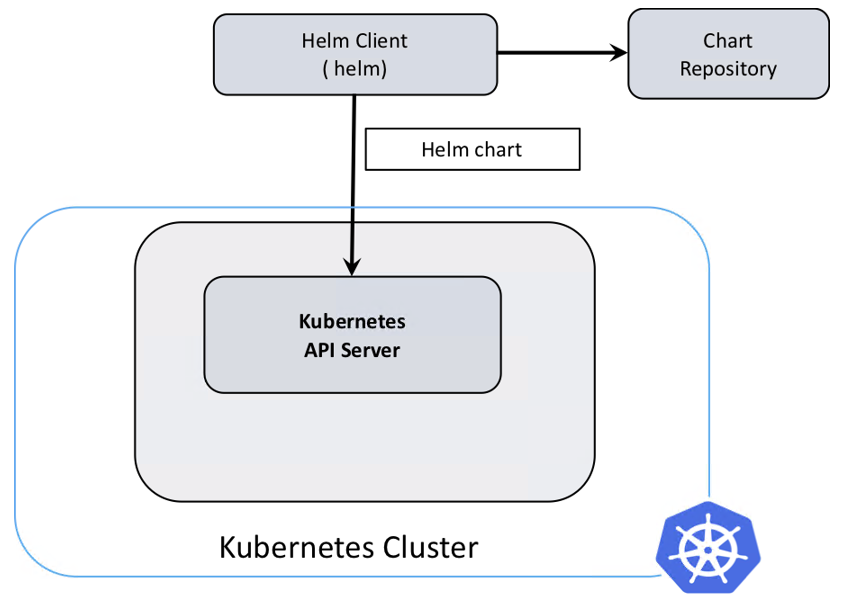

# Helm v3.0.2 安装和使用

- ### 介绍

Helm是Kubernetes的包管理器，主要用来管理 Charts。Helm Chart是用来封装Kubernetes原生应用程序的一系列YAML文件。可以在你部署应用的时候自定义应用程序的一些Metadata，以便于应用程序的分发。对于应用发布者而言，可以通过Helm打包应用、管理应用依赖关系、管理应用版本并发布应用到软件仓库。对于使用者而言，使用Helm后不用需要编写复杂的应用部署文件，可以以简单的方式在Kubernetes上查找、安装、升级、回滚、卸载应用程序。Helm和Kubernetes之间的关系可以如下类比。

- Helm  <-->  Kubernetes
- Apt  <-->  Ubuntu
- Yum  <-->  CentOS
- Pip  <-->  Python

下图展示了Helm的整体架构。

Kubernetes的应用编排存在着一些问题，Helm可以用来解决这些问题。

- 管理、编辑与更新大量的Kubernetes配置文件
- 部署一个含有大量配置文件的复杂Kubernetes应用
- 分享和复用Kubernetes配置和应用
- 参数化配置模板支持多个环境
- 管理应用的发布：回滚、diff 和查看发布历史
- 控制一个部署周期中的某一些环节
- 发布后的测试验证

- ### 安装

下载helm v3.0.2，地址[https://get.helm.sh/helm-v3.0.2-linux-amd64.tar.gz](https://get.helm.sh/helm-v3.0.2-linux-amd64.tar.gz)。上传helm-v3.0.2-linux-amd64.tar.gz并解压。

    tar zxvf helm-v3.0.2-linux-amd64.tar.gz

将helm拷贝到系统path路径下，以下为/usr/local/bin/helm。

    mv linux-amd64/helm /usr/local/bin/helm

查看helm版本。

    helm version
    version.BuildInfo{Version:"v3.0.0", GitCommit:"e29ce2a54e96cd02ccfce88bee4f58bb6e2a28b6", GitTreeState:"clean", GoVersion:"go1.13.4"}

- ### 使用

增加常用chart源。helm提供了常用的chart源，可以在helm的hub库[https://hub.helm.sh/charts](https://hub.helm.sh/charts)查看提供的各种应用的chart库，左边是各种官方chart库，右边是chart库中的应用chart。

    #应该都不需要科学，stable是官方的，aliyuncs最快
    helm repo add stable https://kubernetes-charts.storage.googleapis.com
    helm repo add incubator https://kubernetes-charts-incubator.storage.googleapis.com    
    helm repo add bitnami https://charts.bitnami.com/bitnami
    helm repo add aliyuncs https://apphub.aliyuncs.com
    
    #查看chart列表
    helm repo list
    NAME            URL
    stable            https://kubernetes-charts.storage.googleapis.com
    incubator     https://kubernetes-charts-incubator.storage.googleapis.com
    bitnami         https://charts.bitnami.com/bitnami
    aliyuncs        https://apphub.aliyuncs.com

使用helm安装一个应用，如tomcat，先查找tomcat。其中APP VERSION是tomcat的版本，CHART VERSION是Chart的版本。选择bitnami/tomcat安装，版本比较新。

    helm search repo tomcat
    NAME            CHART VERSION   APP VERSION     DESCRIPTION
    aliyuncs/tomcat 6.0.5           9.0.27          Chart for Apache Tomcat
    bitnami/tomcat  6.1.3           9.0.30          Chart for Apache Tomcat
    stable/tomcat   0.4.0           7.0             Deploy a basic tomcat application server with s...

对于初学者来说，可以先将tomcat的chart库直接拉下来，查看其配置结构。

    helm pull bitnami/tomcat --untar

    ls
    tomcat
    
    tree tomcat
    tomcat
    ├── Chart.yaml
    ├── ci
    │   └── values-with-ingress-and-initcontainers.yaml
    ├── README.md
    ├── templates
    │   ├── deployment.yaml
    │   ├── _helpers.tpl
    │   ├── ingress.yaml
    │   ├── NOTES.txt
    │   ├── pvc.yaml
    │   ├── secrets.yaml
    │   └── svc.yaml
    └── values.yaml

其中最关键的是tomcat/values.yaml文件。

> 可以从helm的hub库中查找tomcat的安装说明。
>
> 可以在网上查看各种详细介绍helm的文章，作者计划将来也会介绍，但为了尽快安装helm，下面直接给出安装命令。

直接在线安装bitnami/tomcat，my-web为release名称；service.type=NodePort表示将tomcat的service对外暴露端口的方式改为NodePort（缺省为LoadBalancer）；persistence.enabled=false表示将不启用持久化存储卷（缺省为true，启用持久化存储卷需要提前准备共享文件系统，比较复杂，此处简化）。
    
    helm install my-web bitnami/tomcat --set service.type=NodePort --set persistence.enabled=false
    NAME: my-web
    LAST DEPLOYED: Wed Jan  1 16:09:06 2020
    NAMESPACE: default
    STATUS: deployed
    REVISION: 1
    TEST SUITE: None
    NOTES:
    ** Please be patient while the chart is being deployed **
    
    1. Get the Tomcat URL by running:
    
      export NODE_PORT=$(kubectl get --namespace default -o jsonpath="{.spec.ports[0].nodePort}" services my-web-tomcat)
      export NODE_IP=$(kubectl get nodes --namespace default -o jsonpath="{.items[0].status.addresses[0].address}")
      echo http://$NODE_IP:$NODE_PORT/
    
    2. Login with the following credentials
    
      echo Username: user
      echo Password: $(kubectl get secret --namespace default my-web-tomcat -o jsonpath="{.data.tomcat-password}" | base64 --decode)

查看安装结果。

    kubectl get all
    NAME                                 READY   STATUS    RESTARTS   AGE
    pod/my-web-tomcat-5759ff9f44-df594   1/1     Running   0          7m30s
    
    NAME                    TYPE        CLUSTER-IP     EXTERNAL-IP   PORT(S)       AGE
    service/kubernetes      ClusterIP   10.1.0.1       <none>        443/TCP       17d
    service/my-web-tomcat   NodePort    10.1.138.156   <none>        80:34983/TCP   7m30s
    
    NAME                            READY   UP-TO-DATE   AVAILABLE   AGE
    deployment.apps/my-web-tomcat   1/1     1            1           7m30s
    
    NAME                                       DESIRED   CURRENT   READY   AGE
    replicaset.apps/my-web-tomcat-5759ff9f44   1         1         1       7m30s

访问[http://192.168.1.55:34983/](http://192.168.1.55:34983/)，如果可以访问说明tomcat安装成功。